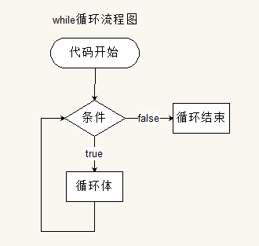
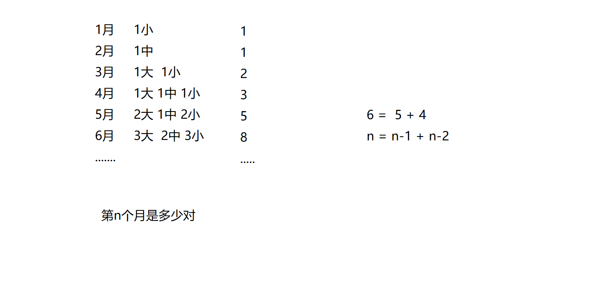
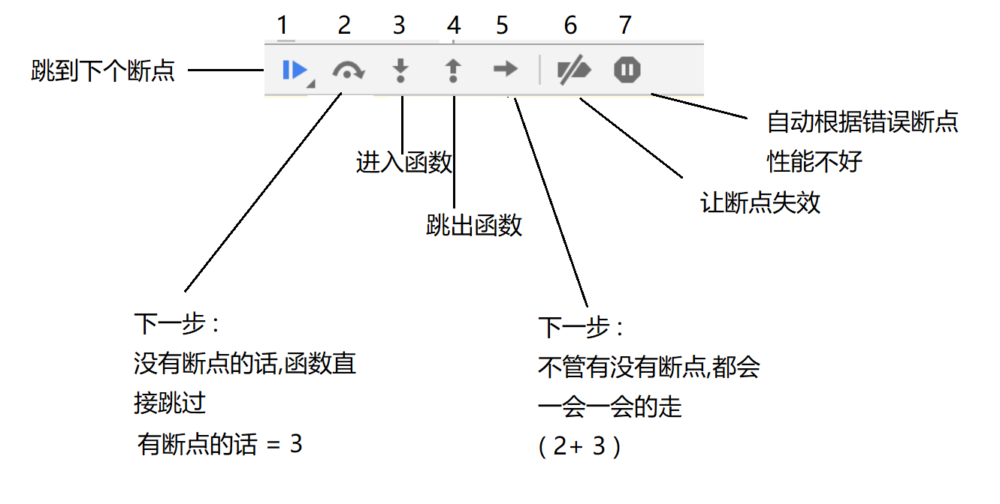
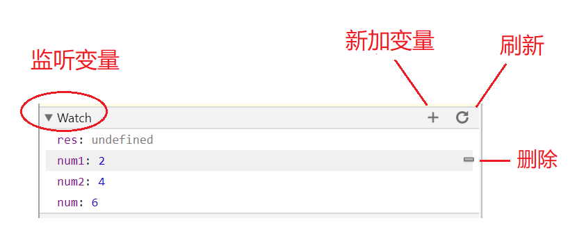
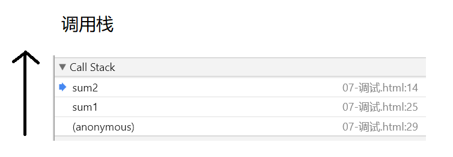

# JavaScript 基础


# 书写位置

- 第一种 : 写在`script`标签中

```html
<script>
  alert('Hello World!');
</script>
```

- 第二种 : 引入一个js文件

```html
<script src="main.js"></script>
```

**注意：**

1.  script 可以放在很多地方,但是我们一般规范写在body的最后面；
2.  使用src 引入的标签不能再在标签内写js代码 (写了不会执行)


# 注释

> 注释代码不会被执行，仅仅起到一个提示的作用。注释可以对复杂的代码进行解释，方便后期的维护和开发。

- 单行注释 : 

  ```js
  // 这是单行注释， 单行注释只能写一行代码
  //  快捷键： ctrl + /  
  ```

- 多行注释 :

  ```js
  /*
  	这是多行注释，在多行注释中可以
  	换行
  	快捷键  ctrl + shift + /
  	不可嵌套
  */
  ```


# 输出语句 (5种)

- **alert : 警告框**

  ```js
  //alert会弹出一个警告框
  alert("hello world");
  ```

- **confirm : 确认框**

  ```js
  //confirm弹出一个确定框
  confirm("我帅吗？");
  ```

- **prompt : 输入框**

  ```js
  //prompt:弹出一个输入框，可以输入值
  prompt("请输入你的真是年龄");
  ```

- **document.write : 网页中写入内容**

  ```js
  //可以识别标签
  document.write("hello world");
  document.write("<h1>hello world</h1>");
  document.write(Date());//输出当前时间
  ```

- **console.log：控制台输出**

  ```js
  //F12打开控制台，在console中可以看到打印的信息
  console.log("hello word");
  ```


# 变量 

```javascript
//var 声明变量
var age;
age = 12; //先声明,后赋值
var age = 12; //同时声明+赋值
var age,name,sex; //直接声明变量,可一次声明多个，用逗号隔开
height=100; //不声明变量，直接赋值(不会报错，但是不推荐)
console.log(heightt); //不声明变量，也不赋值变量，直接使用（会报错）v

function add (num1,num2){ 
	return num1+num2;//把两个数字加起来
}
/*
var student = {
	name:"小明"
}
*/
```


* 变量**命名要求**(变量是[标识符][1]的一种)
  1.以字母、下划线或美元符号（\$）开头
  2.由字母、下划线、美元符号（\$）和数字组成
  3.标识符**区分大小写**
  4.标识符不能使用关键字和保留字
  5.如果重新声明 JavaScript 变量，该变量的值不会丢失

  >var car="yellow";
   var car;  //car 的值依然是 "yellow"


>关键字 (有特殊意义的一些单词)
>`break` `do` `instanceof` `typeof` `case` `else` `new` `var` `in` `catch` `finally` `return` `void` `continue` `for` `switch` `while` `try` `debugger` `function` `this` `with` `default` `if` `throw` `delete`
>
>保留字
>`abstract` `enum` `int` `short` `boolean` `export` `interface` `static` `extends` `long` `super` `Char` `final` `native` `Class` `synchronized` `package` `throws` `Const` `goto` `private` `transient` `degubber` `implements` `volatile` `double` `import` `public` `byte` `float` `protected`


交换两个变量的值

var a = 10;
var b = 20;

1. 交换两个变量的值  **(必须掌握)**

   ```js
   var temp = a;
   	a = b;
   	b = temp;
   ```

2. 不使用临时变量，交换两个数值变量的值  **(了解)**

   ```js
   a = a+b;
   b = a-b;
   a = a-b;
   ```


# 基本数据类型


## typeof 操作符

> 是一个操作符而不是函数，圆括号可以使用，但不是必需的

```javascript
var num;
typeof (num); //undefined
typeof (num1); //undefined
//对未初始化和未声明的变量执行 typeof 操作符都返回 undefined 值

var num = 1;
typeof num; //number

var num = '1';
typeof num; //string

var flag = true;
typeof flag; //bollean

typeof true; // boolean

typeof null; //object //null 被认为是一个空的对象引用

var cat = {name:'kitty'};
typeof cat; //object
```


## Number

* 浮点数

```javascript
var num = 3.1416;//3.1416
var num = 3.12e2;//312
var num = 3.12e-1;//0.312
```


* 整数

```javascript
var num = 10;//10
var num = 070;//56 (八进制)
var num = 0xA;//10 (十六进制)
```


* 特殊值
> `NaN` `Infinity`

```javascript
var num = 1/0;//Infinity (无穷大)
```

	通过isNaN()可以判断是否是一个数字，返回false的时候，表示是一个数字


- 浮点数精度丢失问题

```javascript
//在进行浮点数运算的时候，可能会出现精度丢失的问题
0.1 + 0.2 = 0.30000000000000004;
0.2 + 0.2 = 0.4;
//尽量少用浮点数进行运算，不要让浮点数进行比较。

解决办法 : 根据小数点后面的位数量 乘以对应的整数;
0.1 + 0.2  ==> (0.1*10+0.2*10) / 10 = 0.3
0.01 + 0.02 呢?
```


## String

只要是在**单引号或双引号**内的就是String类型

```javascript
var name = "hello"
var name = 'july'
var name = '3.1416'
```

使用索引位置来访问字符串中的每个字符,字符串的索引从 0 开始:

```java
var name = "july"
var character = name[3];//y
console.log(name.length); //4
```

>若在字符串中使用引号，字符串中的引号不要与字符串的引号相同，或在字符串添加转义字符`\`来使用引号

>内置属性 length 来计算字符串的长度

字符串可以是对象

```javascript
var x = "john";
var y = new String("john");
typeof x; // String
typeof y; // Object
```

## Boolean

布尔型，只有 `true` 和 `false` 两个值，且是小写 
* true  `1`、`2`、`1.1`、`-1`、`"0"`、`"1"`、`[]`、`Infinity` 
* false `0`、`""`、`null`、`NaN`、`undefined`

>所有非0数都是true，0是false

```javascript
var sex = true;
if(sex){
	document.write('男');
}else{
	document.write('女');
}
```

## Array

```javascript
var car = new Array();
cat[0] = "yellow";
cat[1] = "red";
cat[2] = "blue";

var cat = ["yellow","red","blue"];
```

>关键词`new`用于声明新变量的类型


## Object

由花括号分隔，属性和方法的容器；对象的属性以名称和值对的形式 (name : value) 来定义；属性由逗号分隔。对象的方法定义了一个函数，并作为对象的属性存储。对象方法通过添加 `()` 调用

```javascript
var cat = new Object();
cat.name = "kitty";
cat.age = "2";
cat.eat = function(){ }

var cat = {
	name:'kitty',
	age:2,
	eat:function(){
	}
};
```

对象属性有两种访问方式：

```javascript
name = cat.name;
name = cat["name"];
```

对象方法的访问：

```javascript
eat = cat.eat();//输出函数执行结果
eat = cat.eat;//输出函数表达式
```


## Null

只有一个值：`null`,表示对象不存在

```javascript
var cat = null;//将cat的值清空
```


## Undefined

只有一个值：`undefined`

* 以声明未赋值的变量

```javascript
var a;
console.log(a); //undefined
```

* 没有明确返回值的变量

```javascript
//  获取对象不存在的属性
var obj = {a:1,b:2};
console.log(obj.c); //undefined

// 数组下标不存在
var arr = ["zs", "ls", "ww"];
//           0    1     2      下标从零开始，长度为3
arr[5]; // undefined

// 函数没有返回值
function getSum(a, b) {
        console.log(a + b);
    }
// getSum(20, 30); // 50
var result = getSum(20, 30);
console.log(result); // undefined
```


# 原始类型与引用类型

* 原始类型

> `Number` `String` `Boolean` `Undefined` `Null`

* 引用类型

> `Object`

```javascript
var num1 = 123;
var num2 = num1;
num2 = 456;
console.log(num1);//123

var obj1 = {a:1};
var obj2 = obj1;
obj2.a = 3;
console.log(obj1.a);//3
```

>原始类型和引用类型的存储结构不一致，其实，针对“=”本身，对这两种数据类型是没有本质区别的，都是"="左边的值等于右边的值，但不同的是，**针对引用类型，赋值符“=”改变的是对象引用，而不是对象本身**，也就是说当程序执行完`var obj2 = obj1;`之后，obj1和obj2，均指向了同一个对象，因此对obj2的任何操作，同时也会影响到obj1。


# 数据类型转换

## 转换成字符串

1. 调用 toString() 方法 （显式转换）

   ```js
   var a = 1;
   var result = a.toString();
   console.log(typeof result);  //string
   console.log(typeof a);  //number
   ```

   null 、undefined 没有 toString() 方法

2. 调用String()构造函数（显式转换）

   ```javascript
   va str1 = String(a);
   console.log(typeof str1); //string
   ```

3. 直接和字符串做加法运算(推荐方法) （隐式因式转换）

   ```javascript
   var str2 = a + "";
   console.log(typeof str2);   //string
   
   var b = true
   console.log(typeof (b + ""));  //string
   // 任意数据类型的变量和字符串做加法运算结果都是字符串
   ```


## 转换成数值

1.  Number(a) 

```javascript
var a = "123"
var num1= Number(a);
console.log(typeof num1); //Number

// 如果字符串不能转换成合法数字，转换结果为NaN

```

2. 使用parseInt()

```javascript
var b = "12.3";
var num2 = parseInt(b);
console.log(typeof num2); //number
console.log(num2); //12 只保留整数

var c = "15xyz";
var d = "15x6yz";
var num3 = parseInt(c);
var num4 = parseInt(d);
console.log(typeof num3); //number
console.log(num3); //15
console.log(num4);//15
//如果字符串里有非法的数字，会逐个转换，直到遇到无法转化的字符串为止

```

3. 使用parseFloat()完成

```javascript
var c = "12.34";
var num3 = parseFloat(c);
console.log(typeof num3);  //number
console.log(num3);  //12.34 可以保留小数位
```

4. 让字符串和数字做除了加法以外的运算（隐式转换）

```javascript
var d = "345";
var num4 = +d; （前面加 + 号也可以转换）
//num4 = d - 0;
//numb4 = d * 1;
//num4 = d / 1 ;
console.log(typeof num4); //number
console.log(num4); //345
```


## 转换成布尔值

1. 使用Boolean()完成

```javascript
var a = 45;
var result1 = Boolean(a);
console.log(typeof result1);  //boolean
console.log(result1);  //true
// 对于数字类型来说：一般的数字都转换成为true，0、NaN 会被转换成为false

var str = "hello";
//var str = "";
//var str = " ";
var result2 = Boolean(str);
console.log(typeof result2); //boolean
console.log(result2);  //true
//字符串中只有空的字符串会被转换成为false

var result3 = Boolean(undefined);
console.log(typeof result3);  //boolean
console.log(result3);  //false

var result4 = Boolean(null);
console.log(typeof result4);  //boolean
console.log(result4);  //false

var b = false;
var result5 = Boolean(b);
console.log(typeof result5);  //boolean
console.log(result5);  //false
```

**0,NaN,空字符串，undefined,null,false会被转换成为false**

 

2. 使用 !!

```javascript
console.log(typeof !!a); //boolean
console.log(!!a); //true
```


3. 自动转换

```
if("") {
    console.log("哈哈");
}
```


# 操作符

## 算数操作符

> `+`、`-`、`*`、`/`、`%`

```javascript
var num = 5 + 6; //11
var num = 5 % 2; //1 取余数
var num = 5 % (-2); //1
var num = (-5) % 2; //-1 只与左边值的符号有关

var num = "5" + 6 + 7; //"567" 数字与字符串相加，返回字符串
var num = 5 + 6 + "7"; //"117"
var num = "" +5 + 6 + "7"; //"567" 字符串+数字得到字符串
var num = "" +5 + 6 + 7; //"567"

var num = 5 + true; //6  返回数值，false 转成 0，true 转成 1

var num = "1" + true;//"1true" 字符串与布尔值相加,布尔值转化成字符串
```

## 赋值操作符

> `a = a + 1`即`a++`,`a--`即`a = a - 1`
> `a = a + 5`可简写成`a += 5`，类似的还有`a -= 5`、`a *= 5`、`a /= 5`、`x %= y`
>
> 赋值运算符左边不能是常量或表达式

```javascript
var age = 10;
var num = age++;//num=10 age=11 (先将变量中的值取出做赋值操作,再自身+1)

var age = 10;
var num = ++age;//num=11 age=11 (先自身+1,然后再将+1后的结果赋值)

var num = 5;
console.log(num++); //5
console.log(++num); //7

var x = 3;
var y = x++ + ++x + x * 10;//x=3
//y = 3 + ++x + x * 10  //x=4
//y = 3 + 5 + x * 10 //x=5
//y = 58
```

## 关系操作符

> `>`、`<`、`>=`、`<=`

```javascript
var result = 6 > 4;
alert(result); //true 输出Boolean类型
```


> `==` 相等、`！=` 不相等、`===` 全等、`！===` 不全等

运算符的结果类型为 `Boolean`

* `==` 相等、`!=` 不相等  （字面量比较）
  在转换不同的数据类型时，相等和不相等遵循以下规则：   
  1. 如果有一个操作数是布尔值，则在比较相等性前先将其转换为**数值**---false转换为0，true转换为1；  

  2. 如果一个操作数是字符串，另一个操作数是数值，则在比较相等性前将字符串转换为数值；

  3. 如果两个值都是字符串，则按照字符串的字符编码进行逐位比较
  4. 如果一个操作数是对象，另一个不是，则调用对象的valueOf()方法，用得到的基本类型值按照前面的规则比较；  
  5. **null和undefined是相等的**；  
  6. 在比较相等性之前，不能将null和undefined转换为其他任何值;  
  7. 如果有一个操作符是NaN，则相等操作符返回false，不相等操作符返回true；即使两个操作数都是NaN,也一样；  
  8. 如果两个操作数都是对象，则比较它们是否指向同一个对象


* `===` 全等、`！===` 不全等      
  两个操作数在未经转换的情况下相等返回true，不相等返回false;
```javascript
0 == false;//true
1 == true;//true
2 == true;//false

'' == 0;//true
'4' == 4;//true

null == undefined;//true
undefined == 0;//false
null == 0;//false

"NaN" == NaN;//false
5 == NaN;//false
NaN == NaN;//false
NaN != NaN;//true

"4" === 4;//false
undefined === null;//false
```


## 逻辑操作符

> `！` 非、`&&` 与、`||` 或 

* `!` 对Boolean值取反

```javascript
var flag = true;
alert(!flag);//false

alert(!0);  //true
alert(![]);  //false
alert(!“”);  //true
alert(!![]);  //true
alert(!!1);  //true
```

* `&&` 如果第一个值转换成boolean值之后为true， 则输出第二个值；如果第一个值转换成boolean值之后为false，则输出第一个值，且第二个值不在执行。（取第一个为false的值，如果都为true ，则输出最后一个值。）

```javascript
var result = true && 3; //3
var result = 1&&3; //3
var result = [] && ""; //""
var result = false && 3; //false
var result = "" && 3; //""
var result = null && true; //null

var num = 0;
var result = "" && num++; //""   num = 0 
```

* `||` 如果第一个值转换成boolean值之后为true， 则输出第一个值，且第二个值不在执行；如果第一个值转换成boolean值之后为false，则输出第二个值，以此类推，（取第一个为true的值，如果都为false ，则输出最后一个值。）

```javascript
var result = true || 3; //true
var result = 1 || 3; //1
var result = [] || ""; //[]
var result = false || 0; //0
var result = "" || 3; //3
var result = numm || true; //true

var num = 0;
var result = 3 || num++; //3  num=0
```


## 操作符的优先级

从高到低如下：

* () 优先级最高

* 一元运算符 ++  --   !

* 算数运算符 先 * / % 后 + -

* 关系运算符 >  >=  <  <=

* 相等运算符 ==  !=  ===  !==

* 逻辑运算符  先 &&  后 ||

* 赋值运算符


# 判断语句

## if 语句

- 单独的if语句

```js
// 语法
if (条件) {
    // 只有当条件为 true 时,执行代码
}

var age = 10;
if (age >= 18) {
    console.log('可以访问该网站')
}
```

- `if..else` 语句

```js
// 语法
if (条件) {
    // 当条件为 true 时执行的代码
}else {
    // 当条件不为 true 时执行的代码
}

var age = 10;
if (age >= 18) {
    console.log('可以玩吃鸡')
}else {
    console.log('不可以玩吃鸡')
}
```

- `if..else if ..else` 语句

```js
if (条件1) {
  // 当条件1为  true 时执行的代码
}else if (条件2){
  // 当条件2 为true 时执行的代码
}else {
  // 当条件1和 条件2 都不为true 时执行的代码
}
```


## 三元运算符

```js
条件 ? 表达式1 : 表达式2
1. 如果`条件`的值为true，会返回表达式1的值
2. 如果`条件`的值为false，会返回表达式2的值
//求两个数的最大值
var max = n1 > n2 ? n1 : n2;
```


## switch语句

> if..else适用于范围的判断，switch..case适用于具体的值的判断

```js
//语法
switch (变量) {
  case 值1:
    语句1;
    break;
  case 值2:
    语句2;
    break;
  …
  default:
    默认语句;
    break;
}
```

> 注意 :
> break可以省略，如果省略，代码会继续执行下一个case
> switch 语句在比较值时使用的是**全等**操作符, 因此不会发生类型转换（例如，字符串'10' 不等于数值 10）


# 循环语句

## while循环



基本语法 :

```js
//当循环条件为true时，执行循环体，
//当循环条件为false时，结束循环。
while(循环条件){
  //循环体：需要循环执行的语句
}
```

代码示例:

```js
// 计算1-100之间所有数的和  (讲)
// 初始化变量
var i = 1;
var sum = 0;
while(i <= 100){//判断条件
  sum += i;//循环体
  i++;//自增，修改循环条件（不能省略）
}
console.log(sum);
```


## do..while循环

> do..while循环和while循环非常像，二者经常可以相互替代，但是do..while的特点是不管条件成不成立，都会执行一次。


基础语法 :

```js
do {
    //循环体;
}while(条件)
```

代码示例 :

```js
//初始化变量
var i = 1;
var sum = 0;
do{
  sum += i;//循环体
  i++;//自增
}while(i <= 100);//循环条件
```


## for循环


for循环语法：

```js
//1. for循环使用分号分隔
//2. for循环有2个分号，两个分号不能少
for(初始化语句;判断语句;自增语句){
  //循环体
}
```

执行顺序：1243  ----  243   -----243(直到循环条件变成false)

1. 初始化语句
2. 判断语句
3. 自增或者自减
4. 循环体

for循环代码示例：

```js
//打印1-5之间所有数
for ( var i = 1;i<=5;i++ ) {
    console.log(i);
}
```

思考1：

```javascript
//1 求1-100之间所有数的和、平均值
//2 求1-100之间所有数的乘积
//3 计算1-100之间能3整除的数的和
```

思考2：

```javascript
//1 计算1-100之间不能被7整除的数的和
//2 求1-100之间所有偶数的和
//3 同时求1-100之间所有偶数和奇数的和
```

思考3（双重for循环）：

```javascript
//1  网页打印5*5方形★阵  document.write();
//2  网页打印直角三角形
//3  网页打印9*9乘法表
```


## break和continue

> **break**:    结束/中止循环（可以用在switch语句和循环语句中）
>
> 立即跳出当前整个循环，即循环结束，开始执行循环后面的内容（直接跳传出大括号）
>
> **continue**:   结束本次循环，进行下一次循环 （只能用在循环语句中）
>
> 立即跳出当前循环，继续下一次循环（跳到i++的地方）
>
> 在一个循环里，continue 和 break 后面不能在写任何语句，因为永远无法执行到

思考1 :

```js
//输出结果是什么？ 1 2 3 4 6
for(var i = 1; i <=10; i++) {
  if(i == 5){
    continue;
  }
  if(i == 7){
    break;
  }
  console.log(i);
}
```


## 总结 :

1. 循环有很多种，但是以后用得最多的是for循环
2. 当不明确循环次数的时候，可以使用while循环
3. 当无论如何都要执行一次代码的时候，可以使用do..while循环。
4. 循环可以相互替代。


# Array 数组

- 将多个元素，按一定顺序排列放到一个集合中 ， 那么这个集合我们就称之为数组
- 可以存放任意类型的数据（一般一个数组只存放一种类型）
- 特点 :  用逗号隔开，有顺序，有长度，数组长度可以动态调整
- 用途 : 存储大量的数据

```js
// 为什么要有数组?
// 1. 我们知道,,一个变量能够存储一个值, 当我们想要存储多个值的时候, 就可以使用数组。比如存储一个班级里面所有学生的名字;
// 2. 使用数组可以对多个相同类型的值统一的管理,存储起来方便,操作的时候,也会很方便;
```


## 创建数组

1. 通过 **构造函数** 创建数组

   ```js
   var arr = new Array(); // 创建了一个空数组
   var arr = new Array(4); // 创建了一个数组，长度为4,里面全是空值
   var arr = new Array("4"); // 创建了一个数组，长度为1,内容为字符串 "4"
   var arr = new Array(2,3); // 创建了一个数组，里面存放了2个数字
   ```

2. 通过 **数组字面量** 创建数组

   ```js
   var arr1 = []; // 创建一个空数组
   var arr2 = [4]; // 创建了一个数组，长度为1,内容为数字 4
   var arr2 = [2,3]; // 创建一个包含2个数值的数组，多个数组项以逗号隔开
   var arr3 = ["2","b"]; // 创建一个包含两个字符串的数组
   ```


## 数组的长度与下标

- 数组的长度 : 跟字符串一样,数组有一个length 属性,, 指数组中存放的元素的个数 ; 

  ```js
  var arr = [];  // 空数组 长度为 0
  
  var arr = [1,3,5];
  arr.length; // 长度就是3
  
  arr.length = 0; //设置length属性改变数组中元素的个数
  ```

- 数组的下标（又称索引） : 因为数组有序的，有序的就应该有自己的序号，而这个序号就是每个元素对应的下标，**下标从0 开始 , 到 arr.length-1 结束**

  ```javascript
  // 数组取值，如果下标不存在，则返回 undefined
  var arr = ["zs", "ls", "ww"];
  //           0    1     2      下标从零开始，长度为3
  arr[0]; // zs
  arr[2]; // ww
  arr[5]; // undefined
  
  // 数组的赋值
  // 格式：数组名[下标] = 值;
  // 如果下标有对应的值，会把原来的值覆盖，如果下标不存在，会给数组新增一个元素。
  var arr = ["red", "green", "blue"];
  arr[0] = "yellow"; // 把red替换成了yellow
  arr[3] = "pink";   // 给数组新增加了一个pink的值
  // 如果下标有跨度,,中间全是empty 不合法
  
  // 在数组末尾添加新的元素
  arr[arr.length] = 值
  arr.push(值)
  ```


## 数组的遍历

> 遍历 : 对数组的每一个元素都访问一次就叫遍历

数组遍历的基本语法：

```js
for(var i =0; i < arr.length; i++) {
	//数组遍历的固定结构
}
```


## 冒泡排序

```js
// 将数组中的数从小到大排列
var arr = [1,4,6,7,9,3,5,8];
// var arr = [1,2,3,4,5,6,7,8];
var numi = 0;
var numj = 0;
for (var j = 0; j < arr.length -1; j++) {
    numj += 1;
    var flag = true;
    for (var i = 0; i < arr.length - 1 -j; i++) {
        // document.write("(" + arr[i] + "," + arr[i + 1] + ")");
        numi += 1;
        // 两两比较，如果前面的大于后面的，交换位置
        if (arr[i] > arr[i + 1]) {
            flag = false;
            var temp;
            temp = arr[i];
            arr[i] = arr[i + 1];
            arr[i + 1] = temp;
            // document.write("交换了");
        }
    }
    // document.write("，arr=（" + arr + "）");
    // document.write("<br>")
    // 如果一趟下来，一次交换都没有做，说明就已经排好序，就不需要继续比
    if (flag) {
        break;
    }
    // console.log(arr);
}
console.log(arr);
console.log(numi);
console.log(numj);
```


# 函数

> 把一段相对独立的具有特定功能的代码块封装起来，形成一个独立实体，就是函数
>
> 函数的作用就是封装一段代码，只需要声明一次，就可以被多次调用
>
> 提高代码的复用率，提高可维护性

函数三要素包括：**函数名、参数、返回值**


## 函数的声明与调用

```js
// 函数声明
function 函数名() {
    // 函数体
}

// 函数表达式

var 函数名 = function(){
    //函数体
}

// 函数调用
函数名();

```

特点：

1. 函数声明的时候,函数体并不会执行,函数体只有在调用的时候,才会执行；
2. 可多次调用；

练习：

```js
// 1. 封装一个打招呼的函数
// 2. 封装一个函数，计算两个数的和
// 3. 封装一个函数，计算1-100之间所有数的和
```


## 函数的参数(arguments)

- **形参 ( 形式参数 )** : 在函数声明时, 设置的参数。作用是占位置 。
- **实参 ( 实际参数 )** : 在函数调用时,传入的参数。 作用 : 函数调用时，会把实参的值赋值给形参，这样形参就有了值，在函数体里，可以直接使用形参!

**语法 :**

```js
// 带参数的函数声明
function 函数名(形参1, 形参2, 形参...){
  // 函数体
}

// 带参数的函数调用
函数名(实参1, 实参2, 实参3);

// 在声明函数的时候，碰到不确定的值的时候，就可以定义成形参
```


> 1. 如果实参的个数大于形参的个数，多余的实参会被 保存到函数的arguments对象里，arguments对象里保存了所有的实参，arguments是一个伪数组（可以像数组一样使用）
> 2. 如果实参的个数小于形参的个数，不够的参数会用 undefined 来补充

```javascript
// 实参个数大于形参个数

function getSum(a, b) {
    // return a + b; // 3
    // 任意多个数相加, 并没有调用形参，即可以省略不写
    console.log(arguments)
    var sum = 0;
    for (var i = 0; i < arguments.length; i++) {
    sum += arguments[i];
    }
    return sum; 
}
var result = getSum(1, 2, 5)
console.log(result); // 8

// 实参个数小于形参个数

function getSum1(a, b, c, d) {
    console.log(d); // undefined
    return a + b + c + d;
}
var result1 = getSum1(1, 2, 5)
console.log(result1); // NaN
```


## 函数的返回值

> 当函数执行完的时候，我们期望函数给我一些反馈（比如计算的结果），这个时候可以让函数返回一些东西。也就是返回值。函数通过return返回一个返回值

返回值语法：

```javascript
//声明一个带返回值的函数
function 函数名(形参1, 形参2, 形参...){
  //函数体
  return 返回值;
}

//可以通过变量来接收这个返回值
var 变量 = 函数名(实参1, 实参2, 实参3);
```

函数返回值注意事项：

- **return 语句代表一个函数的结束，后面不能再有语句（语句不会执行）**
- 函数可以没有返回值，函数如果没有return，那么返回结果是 **undefined**
- 函数的参数可以有多个，但是返回值只能有 **1** 个
- `return;`  在函数包含判断语句时，可以用来直接停掉一个函数的执行

**练习：**

```js
//1. 求两个数的最大值,并且返回。
//2. 求三个数的最大值,并且返回。
//3. 求一个数组的最大值和最小值，并且返回。
```


## 函数内部调用函数

> 在函数内部是可以继续调用别的函数的。

```js
// 求阶乘
function getJc(n) {
    var sum = 1
    for (var i = 1; i <= n; i++) {
        sum *= i;
    }
    return sum;
}
var result = getJc(5);
console.log(result);

//求阶乘和
function getJcSum(n) {
    var sum1 = 0;
    for (var j = 1; j <= n; j++) {
        sum1 += getJc(j);
    }
    return sum1;
}
var result1 = getJcSum(5);
console.log(result1);
```


## 函数是一种数据类型(function)

### 函数可以作为参数

> 通常，我们把作为参数传递的函数叫做回调函数

```javascript
function fn1(fn) {
  fn();
}
fn1(function(){
   console.log("哈哈");
});
```

### 函数可以作为返回值

> 在js高级中，闭包会使用到

```javascript
function fn1() {
    return function(){
      console.log("呵呵");
    }
}
fn1()();// 呵呵
```


## 匿名函数与自执行函数

### 自执行函数 

函数可以自执行

```javascript
(function fn(){
  console.log("我可以自己执行哦");
})();
```

### 匿名函数

> 匿名函数：没有名字的函数

```js
// 匿名自调用函数 ,用完一次就没了
(function () {
	console.log("哈哈");
})();
```

匿名函数如何使用：

```
1. 将匿名函数赋值给一个变量，这样就可以通过变量进行调用
2. 自执行（匿名函数自执行）
```

匿名函数自执行的作用：防止全局变量污染。


## 作用域

> 作用域：变量起作用的区域

**全局作用域** ：在script标签内，**函数外**的区域就是全局作用域，在全局作用内声明的变量叫做**全局变量** 。全局变量可以在任意地方访问。（if/while/for 语句中声明的变量也是全局变量）

**函数作用域** ：在函数内的区域叫做函数作用域，在函数作用域内声明的变量叫做**局部变量** ，局部变量只有在当前函数内才能访问到。

> 隐式全局变量：没有使用var定义的变量也是全局变量，叫做隐式全局变量。(不要使用)


```javascript
var num = 11;
function fn() {
  var num1 = 22;
  num2 = 33;
  num = 33;
  console.log(num1);
}
fn();
console.log(num);
// console.log(num1);
console.log(num2);
```

变量的查找规则：

- 函数内部可以使用函数外部的变量

- 有局部变量就用局部变量，没有局部变量就用全局变量。


```javascript
var num = 10;
var num1 = 10;

function test(){
    var num = 20;
    num = 30;  // num 在局部声明过，只能修改局部的num值
    num1 = 20; // 修改全局的 num1 值
    var num2 = 40; 
    num3 = 50; // 隐式全局
    console.log(num);  // 30
    console.log(num1);  // 20
    console.log(num2);  // 40
    console.log(num3);  // 50
}
test();
console.log(num); // 10

console.log(num1); // 20
// 如果 text 函数没执行过，则num1值为 10

console.log(num3); // 50
console.log(num2); // 报错
```


## 预解析

js执行代码分为两个过程：

- 预解析过程（var 声明与函数声明提升）（提升到当前作用域的最顶端）
- 代码一行一行执行

```js
// 预解析过程
// 1. var声明的变量：只提升声明,不会提升赋值
	var num = 10; var fn = function(){..}
// 2. 函数声明：整体提升
	function fn(){..}
// 先提升var声明的变量，后提升函数声明
// 3. 如果函数声明同名，后者会覆盖前者
// 4. 如果 var声明 和 函数声明 同名,函数声明会把var声明覆盖
```


```javascript
// 函数预解析
// 1.
function fn(){
    console.log(a); // undefined
}
fn();
var a = 1;

// 2.
var n = 45;
function fn5() {
    console.log(n); // undefined
    n = 20;
    console.log(n); // 20
    var n = 0;
    console.log(n); // 0
}
fn5();
console.log(n); // 45

// 3.
console.log(b); // 函数体
var b = 23;
function b() {
    console.log(b);
}
console.log(b); //23
// b(); // 报错

// 4.
console.log(c); // 函数体
c(); // 嘿嘿
var c = function (){
    comsole.log("哈哈");
}

function c() {
    console.log("嘿嘿");
}

//5.
console.log(fn1); // 函数体
fn1();
function fn1(){
    console.log("哈哈"); //哈哈
}
console.log(fn2); // undefined
// fn2(); // 报错
var fn2 = function () {
    console.log("嘿嘿");
}
// 对于函数表达式，函数的调用必须在表达式声明之后
fn2(); // 嘿嘿

// 6.
// 只有用 var 声明的变量才会预解析
// console.log(d); // 报错
d = 5;
console.log(e);
// console.log(f); // 报错
var e = f = 10;
console.log(f); // 10
```


## 递归函数（了解）

> 递归函数：自己直接或者间接调用自己的函数; 
>
> 注意 : 递归函数一定要留有出口，不然就是死循环了


```js
 1. 求1-100所有数的和
 2. 斐波那契数列，有个人想知道，一年之内一对兔子能繁殖多少对？于是就筑了一道围墙把一对兔子关在里面。已知一对兔子每个月可以生一对小兔子，而一对兔子从出生后第3个月起每月生一对小兔子。假如一年内没有发生死亡现象，那么，一对兔子一年内（12个月）能繁殖成多少对？
//兔子的规律为数列，1，1，2，3，5，8，13，21 ,34 , 55, 89, 144
// 求斐波那契数列 Fibonacci 中第n个数
function fn(n) {
    if (n == 1 || n == 2) {
        return 1;
    }
    return fn(n - 1) + fn(n - 2);
}
console.log(fn(12));
```





## 函数的断点调试

```js
1. 跳到下个断点, 如果后面没有断点了,那么代码直接执行完
2. 单步调试 : 下一步  没有断点的话,函数就直接跳过
3. 单步调试 : 进入函数
4. 单步调试 : 跳出函数
5. 单步调试 : 下一步  不管有没有断点,都会一步一步的走,纯碎的下一步
6. 让所有的断点失效
7. 自动根据错误断点
```










测试代码 : 

```js
function sum2() {

    console.log('你愁啥');
    console.log('瞅你咋地');
}


function sum1(num1,num2) {

    var num = num1 + num2;
    console.log('哈哈');
    console.log('嘿嘿');
    num = 10;
    sum2();
    return num;
}

var res =   sum1(2,4);
console.log(res);
```


## 函数的重载

如果多个函数的函数名相同，但是参数或返回值不同，这些函数是不同的函数

参数不同指 1. 参数的个数不同2. 参数的数据类型不同

js中不允许函数的重载，即在js中，只要函数名一样，就是同一个函数，如果两个函数名相同，后边的会覆盖前边的


