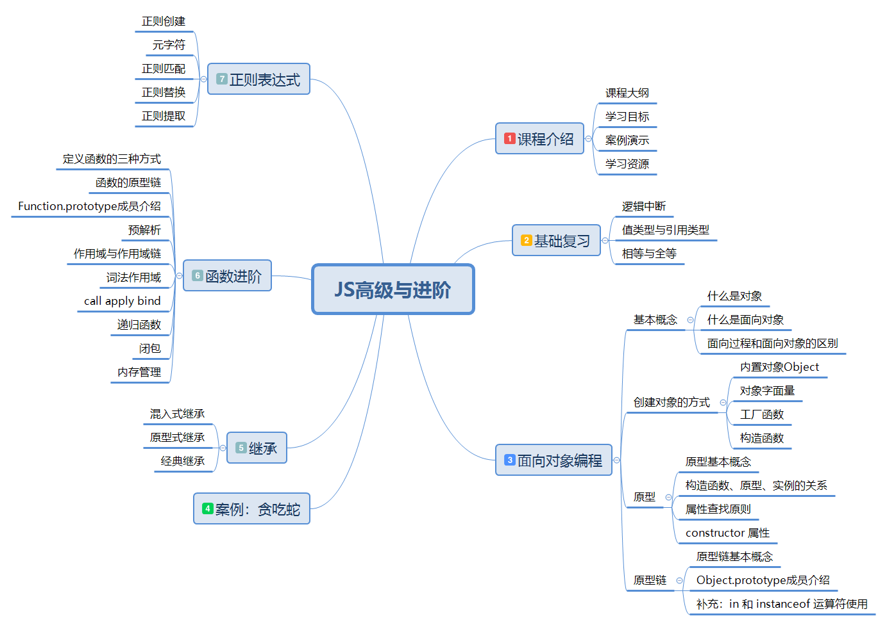
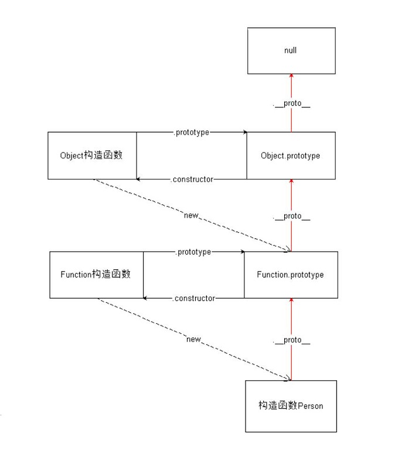

# JavaScript 高级


## 课程大纲




## 面向对象编程

### 基本概念

> Everything is object （万物皆对象）

对象到底是什么，我们可以从两次层次来理解。

**(1) 对象是具体事物的抽象。**

一本书、一辆汽车、一个人都可以是对象，当实物被抽象成对象，实物之间的关系就变成了对象之间的关系，从而就可以模拟现实情况，针对对象进行编程。

问： 书是对象吗

**(2)对象是无序键值对的集合，其属性可以包含基本值、对象或者函数**

每个对象都是基于一个引用类型创建的，这些类型可以是系统内置的原生类型，也可以是开发人员自定义的类型。

### 什么是面向对象？

面向对象编程 —— Object Oriented Programming，简称 OOP ，是一种编程开发思想。

在面向对象程序开发思想中，每一个对象都是功能中心，具有明确分工，可以完成接受信息、处理数据、发出信息等任务。
因此，面向对象编程具有灵活、代码可复用、高度模块化等特点，容易维护和开发，比起由一系列函数或指令组成的传统的过程式编程（procedural programming），更适合多人合作的大型软件项目。

**面向对象与面向过程：**

- 面向过程就是亲历亲为，事无巨细，有条不紊，面向过程是解决问题的一种思维方式，（执行者的角度）
  - 关注点在于解决问题的过程（先xx，然后xx，在xx）；
- 面向对象就是找一个对象，让她去做这件事情（指挥者的角度）
  - 关注点在找到能解决问题的对象上。
- 面向对象不是面向过程的替代，而是面向过程的封装

**面向对象的特性：**

- 封装性
  - 将功能的具体实现，全部封装到对象的内部，外界使用对象时，只需要关注对象提供的方法如何使用，而不需要关心对象的内部具体实现，这就是封装。
- 继承性
  - 在js中，继承的概念很简单，一个对象没有的一些属性和方法，另外一个对象有，拿过来用，就实现了继承。
  - **注意：在其他语言里面，继承是类与类之间的关系，在js中，是对象与对象之间的关系。**
- [多态性]
  - 多态是在强类型的语言中才有的。js是弱类型语言，所以JS不支持多态

## 创建对象的方式

### 内置构造函数创建

我们可以直接通过 `new Object()` 创建：

```javascript
//在js中，对象有动态特性，可以随时的给一个对象增加属性或者删除属性。
var person = new Object()
person.name = 'zs';
person.age = 18;
person.sayName = function () {
  console.log(this.name);
}
```
缺点：麻烦，每个属性都需要添加。

### 对象字面量创建

```javascript
var person = {
  name: 'zs',
  age: 18,
  sayName: function () {
    console.log(this.name);
  }
}
```
缺点：无法批量生成多个对象，代码冗余

### 简单改进：工厂函数

我们可以写一个函数，解决代码重复问题

```javascript
function createPerson (name, age) {
  return {
    name: name,
    age: age,
    sayName: function () {
      console.log(this.name);
    }
  }
}
```
然后生成实例对象：

```javascript
var p1 = createPerson('zs', 18);
var p2 = createPerson('ls', 18);
```
缺点：没有解决对象识别的问题，创建出来的对象都是Object类型的。

### 继续改进：自定义构造函数

构造函数是一个函数，用于实例化对象，需要配合new操作符使用。

```javascript
function Person (name, age) {
  this.name = name;
  this.age = age;
  this.sayName = function () {
    console.log(this.name);
  }
}
var p1 = new Person('zs', 18);
p1.sayName(); // zs
var p2 = new Person('ls', 23);
p2.sayName(); // ls
```


### 构造函数的缺点

使用构造函数带来的最大的好处就是创建对象更方便了，但是其本身也存在一个浪费内存的问题：

```javascript
function Person (name, age) {
    this.name = name;
    this.age = age;
    this.sayHello = function () {
        console.log('hello' + this.name);
    }
}
var p1 = new Person('zs', 18);
var p2 = new Person('ls', 16);
console.log(p1.sayHello == p2.sayHello); // false
```


解决方案：

```javascript
function sayHello() {
  console.log('hello ' + this.name);
}
function Person (name, age) {
  this.name = name;
  this.age = age;
  this.sayHello = sayHello;
}

var p1 = new Person('zs', 18);
var p2 = new Person('ls', 16);
console.log(p1.sayHello === p2.sayHello); // true
```
缺点：会暴漏很多的函数，容易造成全局变量污染。


>  术语：
>
> 1. 实例（实例对象）： 通过构造函数创建出来的对象，叫做实例，实例可以有多个
> 2. 实例化： 构造函数创建对象的过程
> 3. 成员： 对象的属性和方法


## 原型

### 原型基本概念

Javascript 规定，每一个函数都有一个 `prototype` 属性，属性值是 一个对象，这个对象就叫做原型（原型对象），这个对象的所有属性和方法，都会被构造函数的实例继承。

这也就意味着，我们可以把所有对象实例需要共享的属性和方法直接定义在 `prototype` 对象上。

```javascript
function Person (name, age) {
  this.name = name；
  this.age = age；
}

console.log(Person.prototype)；
Person.prototype.sayName = function () {
  console.log(this.name)；
}
var p1 = new Person(...)；
var p2 = new Person(...)；
console.log(p1.sayName === p2.sayName)； // true
```

这时所有实例的 `sayName()` 方法，其实都是同一个内存地址


### `__proto__`

任意对象都有 `__proto__` 属性，这个属性指向了构造函数的prototype属性，也就是原型对象。

获取原型对象：

- 通过 `构造函数.prototype` 可以获取
- 通过 `实例.__proto__` 可以获取（隐式原型）
- 它们指向了同一个对象 `构造函数.prototype === 实例.__proto__`


**注意：`__proto__`是浏览器的一个隐藏（私有）属性，IE浏览器不支持，不要通过它来修改原型里的内容，如果要修改原型中的内容，使用构造函数.prototype去修改**


### constructor 属性

默认情况下，原型对象中只包含了一个属性：constructor，constructor 属性指向了当前原型对象的构造函数。

```javascript
function Person(){

}

console.log(Person.prototype);
console.log(Person.prototype.constructor); // 构造函数本身

var p = new Person();
console.log(p);
// p 实例对象没有constructor 属性， 该属性来源于原型上
console.log(p.constructor == Person.prototype.constructor); // true
```


### 构造函数、实例、原型三者之间的关系

构造函数：构造函数就是一个函数，配合 new 可以新建对象。

实例：通过构造函数实例化出来的对象我们把它叫做构造函数的实例。一个构造函数可以有很多实例。

原型：每一个构造函数都有一个属性`prototype`，函数的prototype属性值就是原型。通过构造函数创建出来的实例能够直接使用原型上的属性和方法。


原型三角关系：

* 构造函数和原型 关系 ：  配偶关系
  * 构造函数（妈妈），通过 prototype 属性访问原型 （爸爸）
  * 原型通过 constructor 属性访问到 构造函数

* 构造函数 和 实例对象：  母子关系
  * 构造函数可以创建实例对象
  * 实例对象不能直接访问到构造函数      

* 原型和 实例对象关系 : 父子关系
  * 实例对象可以直接访问到原型上的所有成员
  * 实例对象可以间接的访问到构造函数(通过原型上的constructor 属性)


## 原型链

### 原型链概念

任何一个对象，都有原型对象，原型对象本身又是一个对象，所以原型对象也有自己的原型对象，这样形成的链式结构，就是原型链。


绘制对象的原型链结构：

```javascript
var p = new Person();
// p ==> Person.prototype  ==> Object.prototype ==> null;
var o = new Object();
// o ==> Object.prototype ==> null;
var arr = new Array();
// arr ==> Array.prototype ==> Object.prototype ==> null;
var date = new Date();
// date ==> Date.prototype ==> Object.prototype ==> null;

// Math 是个内置对象，不是个构造函数
// Math ==> Object.prototype ==> null;
```

总结：Object.prototype是原型链的尽头，Object.prototype的原型是null。


### 属性查找原则

**属性搜索（查找）原则： 沿着原型链进行查找**

1. 首先在当前对象上查找是否有该属性，如果有，直接返回属性值
2. 如果没有，去对象的原型上查找，如果有，直接返回属性值
3. 如果也没有， 沿着原型链进行查找，直到 Object.prototype ，如果找到了，就返回属性值，如果还没有，返回 undefined

**属性修改（设置）原则：**

1. 只会修改对象自身的属性
2. 如果自身没有这个属性，那么就会添加这个属性，并不会修改原型中的属性

```javascript
function Person(name, age){
    this.name = name;
    this.age = age;
}
Person.prototype.name = "zs";
Object.prototype.gender = "male";

var p = new Person("ls", 19);
var p1 = new Person();
console.log(p);

// p 的原型链：
//  p ==> Person.prototype ==> Object.prototype ==> null;

console.log(p.name); // ls
console.log(p.age);  // 19
console.log(p.gender); // male
console.log(p.sex);   // undefined

console.log(p1.name); // undefined
console.log(p1.age);  // undefined
// p1 对象依旧有 name 和age 属性， 只不过属性值都是 undefined
console.log(p1.gender); // male
console.log(p1.sex);   // undefined

p.gender = "不详";
console.log(p);
// console.log(p.gender); // 不详

p.name = "ww";
console.log(p);
// console.log(p.name); // ww
```


### Object.prototype 成员介绍

> 任何对象的原型链上都有 Object.prototype, 根据属性搜索原则(沿着原型链进行查找)， 任何对象都可以访问到 Object.prototype 上的成员。

constructor : 指向了构造函数 Object

#### `hasOwnProperty`

`hasOwnProperty()` 方法会返回一个布尔值，判断对象自身是否具有该属性

```javascript
var obj = {
  name:"zs"
}
//判断name属性是不是obj自己提供的
console.log(obj.hasOwnProperty("name")); // true
console.log(obj.hasOwnProperty("toString")); // false
```


**`hasOwnProperty` 与 `in` 的区别**

1. `in` 操作符：判断对象能否访问到该属性（不管这个属性是自己提供的，还是从原型上继承来的），如果可以访问到， 都会返回 true

2. `hasOwnProperty` : 该属性必须是自己提供，才返回 true，否则返回 false。


**hasOwnProperty 的使用场景**：用在for...in 循环中

```javascript
for(var k in p){
    // 可以遍历到对象自身的属性以及对象原型链上的属性
    console.log(k);

    // 只遍历得到对象自身的属性，if 条件过滤下
    // if(p.hasOwnProperty(k)){
    // 		console.log(k);
    // }
}
```


#### `isPrototypeOf`

`isPrototypeOf()` 方法用于测试一个对象是否存在于另一个对象的原型链上

```javascript
// 判断A对象是否在B对象的原型链上。
// 返回值：true，在原型链上    false：不在原型链上。
A.isPrototetypeOf(B);

function Person(){
}
var p = new Person();

// p 的原型链： 
// p ==> Person.prototype ==> Object.prototype ==> null;

console.log(Person.isPrototypeOf(p)); // false Person是构造函数
console.log(Person.prototype.isPrototypeOf(p)); // true 
console.log(Object.prototype.isPrototypeOf(p)); // true
```


**`isPropertyOf` 与 `instanceof`运算符的区别**

`instanceof` 运算符用来测试一个对象的原型链中是否存在一个构造函数的 `prototype` 属性。作用和isPrototypeOf类似

语法： 实例对象 instanceof 构造函数

作用：构造函数的 prototype 属性是否在实例对象的原型链上

- A.isPrototypeOf(B)  判断A是否在B的原型链上                          A： 是一个原型对象
- B instanceof A         判断A的prototype是否在B的原型链上     A：是一个构造函数


```javascript
console.log(Array.isPrototypeOf([])); // false
console.log(Array.prototype.isPrototypeOf([])); // true

console.log([] instanceof Array); // true
console.log([] instanceof Array.prototype); // 语法错误，instanceof 的右边是个构造函数
```


#### `propertyIsEnumerable`

`propertyIsEnumerable()` 方法返回一个布尔值，表明指定的属性名是否是当前对象可枚举的自身属性。

```javascript
function Person(name){
    this.name = name;
}
Person.prototype.age = 19;
var p = new Person("lw");
console.log(p.propertyIsEnumerable("name")); // true
console.log(p.propertyIsEnumerable("age")); // false
```


拓展：给对象添加不可遍历的属性 : `Object.defineProperty()`

```javascript
// 语法： Object.defineProperty(obj, prop, desc);
// 参数：
// 	obj： 给哪个对象添加属性
// 	prop：属性， 类型是字符串
// 	desc： 属性描述符， 类型是个对象

// 作用： 定义对象的属性特征

var obj = {
    name: "zs",
    age: 19
}
// 给obj 添加一个不可遍历的 gender 属性
Object.defineProperty(obj, "gender", {
    value: "female", // 配置该属性的默认值
    writable: true, // 配置该属性是否可以被修改， 默认值是false， 不可修改
    enumerable: true // 配置该属性是否可遍历， 默认值是false， 不可遍历
});
obj.gender = "male";
console.log(obj);
console.log(obj.propertyIsEnumerable("gender")); // false
```


#### toString/toLocaleString

返回对象的字符串格式

> 每个内置对象的原型上都有属于自己的toString 方法

```javascript
var obj = {
    name: "zs",
    age: 19
}
// obj ==> Object.prototype ==> null;
console.log(obj.toString()); // "[object Object]"
console.log(obj.toLocaleString()); // "[object Object]"

var arr = [1,2,3];
// arr ==>  Array.prototype ==> Object.prototype ==> null;
//           toString()            toString()
console.log(Array.prototype); // 含有自己的 toString 方法
console.log(arr.toString());  // "1,2,3"
console.log(arr.toLocaleString());  // "1,2,3"

var date = new Date();
//  date ==> Date.prototype ==> Object.prototype ==> null;
//           toString()               toString()
console.log(Date.prototype); // 含有自己的 toString 方法
console.log(date.toString()); // Wed Oct 10 2018 16:00:51 GMT+0800 (中国标准时间)
console.log(date.toLocaleString()); // 2018/10/10 下午4:00:51 得到的是本地时间格式
```


#### valueOf

语法： 对象.valueOf()

作用： 返回对象的原始值（简单数据类型），默认的 valueOf 方法（Object.prototype 上的valueOf 方法）只会返回对象自身；日期对象的 valueOf 方法返回的是时间戳，因为 Date 的原型链上有自己的 valueOf 方法，该valueOf 的作用就是返回日期的时间戳

```javascript
var obj = {
    name: "zs",
    age: 19
}
// obj ==> Object.prototype ==> null;
console.log(obj.valueOf()); // obj

var arr = [1,2,3];
// arr ==>  Array.prototype ==> Object.prototype ==> null;
console.log(arr.valueOf()); // arr

var date = new Date();
// date 原型链
// date ==> Date.prototype ==> Object.prototype ==> null;
console.log(Date.prototype); // 含有 valueOf 方法
console.log(date.valueOf()); // 时间戳

```


#### valueOf 和 toString 的应用

当对象在参与运算和比较的时候，js内部会自动的调用 valueOf 和 toString 方法

 调用规则：

1. 默认先调用 vauleOf， 尝试将对象转成简单数据类型， 如果没有转成简单数据类型， 会继续在调用 toString 方法

2. 如果 valueOf 和 toString 方法都没有转成简单数据类型，会报错


## 沙箱模式

沙箱其实就是一个独立的环境，这个环境中任何的改变，都不会对外部环境产生影响

函数自调用一样，在自调用函数内部的变量是不会影响到外部的，因此**函数自调用模式也叫沙箱模式**。

```javascript
(function(window){
    var fn = function(){
        console.log("这是fn函数");
    }
})(window);
```

1. 代码写在自调用函数里面，减少全局污染
2. 想要在外面使用 fn 函数，可将 fn 暴露到全局 `window.fn = fn;`  将fn函数的地址赋值给了 window上的 fn 属性
3. 一般，我们一个js文件只会暴露一个核心的功能（函数、方法）： 目的还是为了减少全局污染

## 严格模式

- 语法：`'use strict'`
- 作用：让js引擎以更加严格的模式执行js代码
- 最佳实践：在某个函数内部开启严格模式，而不是在全局环境中开启
- 注意： 
  - 严格模式只对当前作用域起作用
  - 应该**在当前作用域最顶端使用`use strict`，否则严格模式无效**
- 使用严格模式好处：
  - 规范 
  - 提高代码执行效率

```js
// 严格模式应该配合沙箱模式一起使用。

// 沙箱模式 + 严格模式：
(function () {
  'use strict'
    
})()
```

### 严格模式规定

- 变量必须显示声明
- 函数参数不能重名
- 禁止使用八进制
- 不能使用保留字作为变量名称：`implements, interface, let, package, private, protected, public, static, yield`
- 如果不符合上述规范，会直接报错


## 继承

> 继承：子承父业

在 js 中的继承概念非常简单，拿来主义：一个对象自己没有的属性和方法，另一个对象有，拿过来使用，就实现了继承。

继承的目的：让一个对象可以使用另一个对象的属性和方法。


### 混入式继承（mixin）

> 把一个对象中的属性和方法拷贝到另一个对象中。

```javascript
var ls = {
    name:"zs",
    extend: function(obj) {
        // 只拷贝对象obj自身的成员，原型链上的成员不用拷贝给this
        if(obj.hasOwnProperty(k)){
            this[k] = obj[k]; 
        }
    }
}
```

### 原型链继承

一个对象可以访问构造函数的原型中的属性和方法，那么如果想要让一个对象增加某些属性和方法，

只需要把这些属性和方法放到原型对象中即可。这样就实现了继承, 称之为原型链继承

- 直接给原型增加属性和方法
- 原型替换（注意：constructor）
- mixin+原型替换

```javascript
function Person(){

};

// 1. 直接给原型增加属性和方法（麻烦）
Person.prototype.color = "lime";
Person.prototype.legs = 2;
Person.prototype.sayHi = function(){
	console.log("sayHi");
}
// 2. 原型替换，将原型替换成一个对象
Person.prototype = {
    // 手动添加一个constructor属性，如果不手动添加，会找到 Object 的 construction 属性
    constructor: Person,

    color: "lime",
    legs: 2,
    sayHi: function(){
        console.log("sayHi");
    },
}
// 3. 原型链 + 混入式继承
function Person(){

}   
var lw = {
    skill: "翻墙"
}
// 给原型添加extend方法  -- 混入式继承
Person.prototype.extend = function(obj){
    for(var k in obj){
        if(obj.hasOwnProperty(k)){
            this[k] = obj[k];
        }
    }
}
// 把lw的成员添加到了Person的原型上， Person的实例就可以访问到原型上的这个成员
Person.prototype.extend(lw);
console.log(Person.prototype);
var p = new Person();
console.log(p.skill);
```


### Object.create

> 最初是由道格拉斯丶克罗克福德发布的一篇文章提出的，ECMAScript5新增了Object.create()方法来规范化了这种继承。

ES5中新增了一个方法 `Object.create()`，方法会使用指定的原型对象及其属性去创建一个新的对象

```javascript
//参数：proto 一个对象
//返回值：obj 新对象，新对象的原型就是proto
var obj = Object.create(proto);
console.log(obj);
```


## 函数进阶

### 定义函数的三种方式

#### 函数声明

```javascript
fn();//函数声明可以先调用，在声明
function fn(){
  console.log("这是函数声明")
}
```

#### 函数表达式

```javascript
var fn = function() {
  console.log("这是函数表达式");
}
fn();//函数表达式必须先声明，再调用
```

#### 构造函数Function

```javascript
//函数也是对象，可以使用Function构造函数new出来
//相当于var fn = function(){}
var fn = new Function();

//语法：new Function(arg1,arg2,arg3..,body);
// 1. 所有的参数都是字符串类型。
// 2. 前面可以定义任意多个形参，最后一个参数是代码体。
var fn = new Function("alert(1)");
fn();

var fn1 = new Function("a1", "a2", "alert(a1+a2)");
fn1(1,2);
```

【案例：代码实时预览效果.html】

#### eval函数--了解

> eval 可以和 new Function 一样，执行字符串代码

注意：eval 函数的功能非常的强大，但是实际使用的情况并不多。

```javascript
eval("var num = 10; console.log(num)"); // 10
```

- eval 形式的代码难以阅读
- eval 形式的代码无法打断点，因为本质还是还是一个字符串
- 在浏览器端执行任意的 JavaScript 会带来潜在的安全风险，恶意的 JavaScript 代码可能会破坏应用，特别是在用它执行用户输入数据的情况下。可能会有恶意用户输入威胁你的站点或应用程序安全的代码（即所谓的代码注入）
  [推荐了解下xss攻击](http://qingbob.com/Excess-XSS/)


### 函数的四种调用模式

分析this的指向问题

1. 任何函数都有属于自己的this
2. this 是动态的，this 在函数声明的时候是确定不了的，只有当函数被调用了才能够确定 this 的指向，this 的指向和函数在哪被调用没有关系

分析this的问题的思路：

1. this 是属于哪个函数
2. **这个函数是何种调用模式**


```javascript
函数：当一个函数不是一个对象的属性时，我们称之为函数。
方法：当一个函数被保存为对象的一个属性时，我们称之为方法。
```

#### 函数调用模式

<font color="red">如果一个函数不是一个对象的属性时，就是被当做一个函数来进行调用的。此时 this 指向了 window</font>

```javascript
// 函数名()； 的调用方式
function fn(){
  console.log(this);//指向window
}
fn();
```


#### 方法调用模式

<font color="red">当一个函数被保存为对象的一个属性时，我们称之为一个方法。当一个方法被调用时，this 被绑定到当前对象</font>

```javascript
// 通过点语法或者中括号语法来访问方法，都是属于方法调用模式
var f = function(){
    console.log(this);
}
var obj = {
    a: 1,
    fn: f,
}
obj.fn();   // obj
obj['fn']();  // obj

var arr = [f, 10, 30];
// 也是方法调用模式
arr[0]();  // arr
```


#### 构造函数调用模式

<font color="red">如果函数是通过 new 关键字进行调用的，此时 this 被绑定到创建出来的新对象上。</font>

```javascript
function Person(){
  console.log(this);
}
Person(); // this 指向 window
var p = new Person(); // this 指向 p
```

**总结：分析this的问题，主要就是区分函数的调用模式，看函数是怎么被调用的。**


```javascript
//分析思路：1. 看this是哪个函数的  2. 看这个函数是怎么调用的，处于什么调用模式
// 1.
var age = 38;
var obj = {
    age: 18,
    getAge: function () {
        console.log(this.age);
    }
}
var f = obj.getAge;
f(); // window ==> 38

// 2.
var age = 38;
var obj = {
  age:18,
  getAge:function () {
    console.log(this.age); // obj ==> 18
    function foo(){
      console.log(this.age); // window ==> 38
    }
    foo();
  }
}
obj.getAge();
// obj["getAge"]();

// 3.
var length = 10;
var age = 18;
function fn() {
    console.log(this.length);
}
var arr = [fn, "222"];
fn(); // 10
arr[0](); // 2

// 4.
var length = 10
function fn() {
    console.log(this.length);
}
var obj = {
    length: 5,
    method: function (fn) {
        fn(); // window ==> 10
        arguments[0](); // argument ==> 3
    }
}
obj.method(fn, 10, 5);
```


#### 方法借用模式

> 上下文调用模式也叫方法借用模式，分为 apply，call ，bind
>
> 使用方法： 函数.call() 或者函数.apply()

任何函数都可以调用 apply，call ，bind 这三个方法

##### call 方法

call 方法可以调用一个函数，并且可以指定这个函数的`this`指向、、

```javascript
// call方法也可以和()一样，进行函数调用
// 第一个参数：指定函数的this，如果不传，则this指向window
// 其余参数：和函数的参数列表一模一样。
var zs = {
    name: "zs",
    sayHi: function(){
        console.log("hello ,我是" + this.name);
    }
}
// zs.sayHi();
var ls = {
    name: "ls",
}
// ls 借用 zs 的 sayHi 方法
zs.sayHi.call(ls);
```


##### 伪数组与数组

> 伪数组也叫类数组

1. 伪数组其实就是一个对象，但是跟数组一样，伪数组也会有`length`属性，也有`0,1,2,3`等属性。
2. 伪数组并没有数组的方法，不能使用`push/pop`等方法
3. 伪数组可以跟数组一样进行遍历，通过下标操作。
4. 常见的伪数组：`arguments`、`document.getElementsByTagName的返回值`、`jQuery对象`

```javascript
var obj = {
    0: "zs",
    1: "ls",
    2: "ww",
    length: 3
}
```

- 伪数组借用数组的方法

```javascript
// 给obj添加一项 3: "zl"
Array.prototype.push.call(obj, "zl");
// 把obj中的每一项使用 "-" 拼接起来返回一个字符串
Array.prototype.join.call(obj, "-");
```

- 将伪数组转换成真数组

```javascript
var arr = Array.prototype.slice.call(obj);
```


##### apply 方法

```javascript
apply的语法：
apply(thisArg, 实参列表); 
thisArg ==> 改变函数内的this指向的
实参列表 ==> 是一个数组或者是伪数组
```

> `apply()`方法的作用和 `call()`方法类似，只有一个区别，就是`apply()`方法接受的是**一个包含多个参数的数组**。而`call()`方法接受的是**若干个参数的列表**

```javascript
// 1. apply 能够调用函数
function fn(){
    console.log(1);
    }
fn.apply(); // 1

// 2. apply 改变this 指向
function fn(){
	console.log(this);
}
fn.apply([10,20,30]); // [10,20,30]

// 3. apply 第二个参数是数组
function fn(n1, n2){
    console.log(this);
    console.log(n1 + n2);
}
fn.apply({name: "zs"}, [10, 20]); // {name: "zs"}, 30
// apply的特性： 平铺性，把数组中的每一项取出来作为函数的实参
// fn.call({name: "dahuige"}, 10, 20); // {}, 30
```


call和apply的使用场景：

- 如果参数比较少，使用call会更加简洁
- 如果参数存放在数组中，此时需要使用apply

课后练习：

```javascript
1. 求数组的最大值和最小值
2. 封装一个函数，能够打印出来所有的参数。
```


##### bind 方法   

**bind() **方法创建一个新的函数, 可以绑定新的函数的`this`指向

```javascript
// 返回值：新的函数(不会被调用)
// 参数：新函数的this指向，当绑定了新函数的this指向后，无论使用何种调用模式，this都不会改变。
var newFn = fn.bind(window); 
var fn = function(){
    console.log(this);
}
var newFn = fn.bind([1,2,3]);
// newFn 是 bind 创建并返回出来的
console.log(newFn);
newFn(); // this ==> [1,2,3]
```


#### 几种特殊的 this 指向

- 定时器中的 this 指向了window，因为定时器的 function 最终是由 window 来调用的。
- 事件中的 this 指向的是当前的元素，在事件触发的时候，浏览器让当前元素调用了 function


### 函数也是对象

> 函数是由 new Function 创建出来的，因此函数也是一个对象， `所有的函数都是new Function的实例`。


#### 函数的原型链结构

```javascript
// 内部： var Person = new Function();
function Person(){
  
}
// Person 实例对象的原型链：
// Person ==> Function.prototype ==> Object.prototype ==> null;
// Function.prototype 原型类型是个函数
console.dir(Function.prototype);
```

 

#### Function.prototype 成员

- arguments：获取函数的实参，已经被废弃了，现在推荐的做法是使用函数内部可用的 `arguments`对象来访问函数的实参。 
  - （废弃的意思：已经从 Web 标准中删除，虽然一些浏览器目前仍然支持它，但也许会在未来的某个时间停止支持，请尽量不要使用该特性。 ）
- length：获取形参的长度
- name：获取函数的名字，此属性不允许修改
- caller: 用于获取当前函数是在哪个函数中调用的，已经被废弃了
- constructor：指向当前构造函数，Function
- call：调用函数，重新指向 this
- apply：调用函数，重新指向 this
- bind：重新指向 this，返回一个新的函数，不调用
- toString :  得到函数的字符串格式

案例【封装getType函数（获取数据类型）】


#### 完整版原型链

> 绘制完整版原型链的目的是辅助大家理解 js 中对象的继承关系


总结：

1. 所有函数都是 new Function 创建出来的，因此 `所有函数.__proto__` 都是 `Function.prototype`
2. 所有对象都是 new Object 创建出来的，因此 `所有对象.__proto__` 都是 `Object.prototype`
