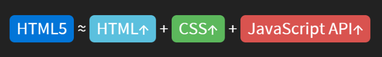
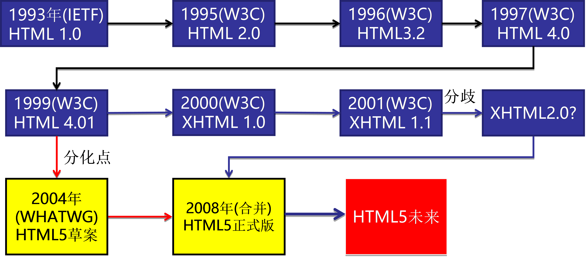

# HTML5 基本概念

## 什么是HTML5？

> HTML5并不仅仅是作为**HTML标记语言的一个最新版本**， 更重要的是它**制定了web应用开发的一系列标准**，成为第一个将web作为应用开发平台的HTML语言。

HTML5定义了一系列新元素，如**新语义标签、多媒体标** 签等，可以帮助开发者开发更加丰富的应用，同时有令人眼花缭乱的css3，还提供了一些Javascript API，如地理定位、重力感应、硬件访问等，可以在浏览器内实现类原生应用，制作webApp，甚至结合Canvas我们可开发网页游戏。

我们日常讨论的H5其实指的是一个泛称，它是由**HTML5+CSS3+javascript** 等技术组合而成的一个应用开发平台。




## HTML5的历史




```javascript
1. WHATWG:Web Hypertext Application Technology Working。 WHATWG成立的原因是W3C意图放弃HTML，而力图发展XML技术。
2. HTML5 的第一份正式草案已于2008年1月22日公布。
3. 2014年10月29日，万维网联盟宣布，经过接近8年的艰苦努力，该标准规范终于制定完成。
```

思考：问什么HTML5在2008年就发布草案了，到2014年才火起来？

因为移动端的推动，HTML在老的浏览器上兼容性很严重，并且HTML5很多新特性其实就是为移动端而出现的，可以说**HTML5是为移动端而生的** 。


# HTML5语义化标签

## 常用语义化标签


> 在HTML5之前，我们布局大多使用div，但是div并没有语义化，HTML5推出了一系列的语义化标签，可以用来表示header、footer等。

HTML5新的语义化标签

`header` 头部、`nav` 导航、`footer` 底部、`aside`  侧边栏、`article` 文章、`section`  区块、`main`   主体区域


本质上新语义标签与`<div>`、`<span>`没有区别，只是其具有语义性，使用时除了在HTML结构上需要注意外，其它和普通标签的使用无任何差别，`<nav>`完全可以理解成`<div class="nav">`。不要好奇，它只是一个标签！就是增加了语义性，更加利于SEO的优化。

html5 还推出了一些其他的标签：[http://www.w3school.com.cn/tags/index.asp](http://www.w3school.com.cn/tags/index.asp)

## 兼容性处理

IE678 不识别这个标签

```javascript
document.createElement("header"); // 创建这个标签即可让IE678识别
// 创建的标签默认是行内样式。
// 还需给标签加一个display:block的属性。
```


借助 `html5shiv.js`

> 我们每次都要去创建标签，并且还需要设置display：block属性，非常麻烦，因此我们可以引入一个第三方js文件，这个js文件的功能就是创建元素和设置display属性。

```javascript
<!-- [if lte IE 8] >  // lte ==> 小于等于
    <script src="js/html5shiv.min.js"></script>
<! [endif] -->
// 当ie浏览器的版本小于等于8的时候，才会引入 html5shiv.js
// css hack
// 条件注释 IE独有的注释
```


# 类名操作(重点)

> js在H5中给所有的DOM对象新增了一个属性 classList
>
> classList 是一个集合，会存储某个元素上所有的类名，使用classList来替代className操作class类

```javascript
// 添加类
div.classList.add("classname");
// 移除类
div.classList.remove("classname");
// 切换类
div.classList.toggle("classname");
// 判断类
div.classList.contains("classname");
```

【tab栏案例】


# 自定义属性操作（重点）

> H5规定，以后但凡给标签增加自定义属性，都应该用 `data-` 开头 (规范)
>
> H5给所有的DOM对象增加了一个 `dataset` 的属性，这个属性中会包含所有 data- 开头的属性

```html
<div id="demo" data-name="zs" data-age="10" data-user-name="ls">
<script>
    var box = document.querySelector('#box')
	console.log(box.dataset) 
    console.log(box.dataset.name) // zs
    console.log(box.dataset['age']) // 10
    console.log(box.userName) // ls 
    box.dataset.aaBb = 'cc' // 在html结构中或添加 data-aa-bb=“cc”的自定义属性
</script>
```

**注意：**html中属性是忽略大小写的，相当于是小写字母，

如果需要大写，应使用中划线 `-` 进行分隔，在js中会转换成驼峰的形式，如`data-user-name ==> userName`


* jquery 中操作自定义属性 `data()`方法

```javascript
// jquery并没有把 data-id 当成自定义属性来用
var dataId = $('div').attr('data-id')
console.log(dataId) // 100

// 在jq中，封装了另一个方法， data()方法,内部使用了缓存来实现，
var a = $('div').data()
console.log(a)// {desc: "呵呵" id: 100 userName: "zs"}
console.log(a.id) // 100
```


# 网络状态

> 在移动端，我们经常需要检测设置是在线还是离线，HTML5为此定义了一个 navigator.onLine 属性，这个属性用于检测设备是否联网。**navigator.onLine** 在不同浏览器中有细微的差别。

## 网络状态
```javascript
navigator.onLine 返回用户当前的网络状况，是一个布尔值
1. 如果浏览器连不上网(包括局域网)，就是离线状态，也就是脱机状态，会返回 false
2. 否则就是在线状态，返回 true
```

**注意：返回true不一定就是说一定能访问互联网，因为有可能连接的是局域网。但是返回false则表示一定连不上网。**

## 监听网络变化
> 为了更好的确定网络是否连接，HTML5还定义了两个事件，用于监听网络状态的变化。

```javascript
// 网络连接时会被调用
window.addEventListener("online", function () {
    alert("online");
});
// 当网络断开时会被调用
window.addEventListener("offline", function () {
    alert("offline");
});
```


# 地理位置

> 在HTML规范中，增加了获取用户地理信息的API，这样使得我们可以基于用户位置开发互联网应用，即基于位置服务LBS(Location Base Service)

## 隐私
HTML5规范提供了一套保护用户隐私的机制。必须先得到用户明确许可，才能获取用户的位置信息。**在获取地理位置之前，会询问用户，只有在获得许可之后，才能获取到用户的位置信息。**

H5提供的获取地理位置信息并不是特别的精确，会一定的误差，如果需要非常精确的定位，还是需要使用安卓或者ios，访问基于操作系统的方法。 （小程序）

## 相关的方法
```javascript
// successCallback:获取成功后会调用,并返回一个position对象，里面包含了地理位置信息
// 获取失败了会调用，并返回error对象，里面包含了错误信息。
// 获取当前的地理位置信息
navigator.geolocation.getCurrentPosition(successCallback, errorCallback)
// 重复的获取当前的地理位置信息
navigator.geolocation.watchPosition(successCallback, errorCallback)
```
实例：
```javascript
navigator.geolocation.getCurrentPosition(function(position){
    // 定位成功会调用该方
    // 法谷歌浏览器进行了限制，看不到，可以再IE浏览器下查看
    // position.coords.latitude 纬度
    // position.coords.longitude 经度
    // position.coords.accuracy 精度
    // position.coords.altitude 海拔高度
}, function(error){
    // 定位失败会调用该方法
    // error 是错误信息
});
```

**苹果浏览器对webkit定位权限进行了修改，所有定位请求的页面必须是https协议的。**


## 百度地图、高德地图、腾讯地图

> 仅仅获取到经纬度对于用户来说意义并不大，因为用户也不知道经度和纬度表示的是地球上的哪一个地方，因为我们可以结合百度地图，准确的将用户的位置显示出来。

百度地图官网：[http://lbsyun.baidu.com/](http://lbsyun.baidu.com/)

```javascript
1. 在开发中，找到javascript API
2. 直接查看示例demo
3. 复制相应的代码，替换掉秘钥就行，秘钥只需创建一个新的应用就可以了。
```


#web存储（重点）

> 在代码执行的时候，数据都是存储在内存中的，当页面关闭或者浏览器关闭的时候，内存就被释放掉了。数据只有存储在硬盘上，才不会被释放。

## cookie

> 传统方式，我们以document.cookie进行存储，但是存储起来特别麻烦，并且，存储大小只有4k。每次请求都会带上cookie

cookie 是以字符串形式存在的，这个字符串有固定的格式：key=value;key1=value1;

在获取cookie内容时，一般需要通过正则或者字符串的方法进行处理，转换成对象，最终得到数据。

```javascript
document.cookie = "name=zhangsan";
document.cookie = "age=18";
document.cookie = "sex=23";

// 设置过期时间
document.cookie = 'sex=12;max-age=3600';

// 读取cookie
var result = document.cookie;
console.log(result);
```

## sessionStorage与localStorage

> HTML5 规范提出了解决方案，使用sessionStorage和localStorage存储数据。设置、读取、删除操作很方便

* window.sessionStorage 的特点

```javascript
1. 生命周期为一个会话周期
2. 不能在多个窗口下共享数据。
3. 大小为5M左右
```

* window.localStorage的特点

```javascript
1. 永久生效，除非手动删除
2. 可以多个窗口共享
3. 大小为5M左右
```

* localStorage 的方法

```javascript
setItem(key, value) // 设置存储内容
getItem(key) // 读取存储内容
removeItem(key) // 删除键值为key的存储内容
clear() // 清空所有存储内容（谨慎使用）
```

* sessionStorage 的方法和 localStorage 的方法相同


【案例-换肤效果】
