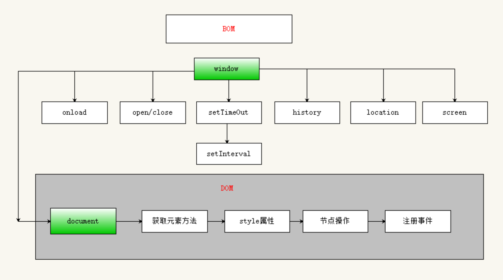

#Web Api 基本概念

**API**（Application Programming Interface,应用程序编程接口）,

**API是一些预先定义的方法，这些方法能够实现某些特定的功能**

- 任何开发语言都会提供自己的API 
- API的特征输入和输出(参数/返回值)

通俗的讲，API就是编程语言给我提供的一些 `工具`，通过这些`工具`，我们可以非常轻易的完成一些功能。

**Web API** : 是浏览器提供的 **一套操作网页(web)的方法(API)**,  通过这套API我们可以非常轻松的操作`页面的元素`和`浏览器的一些功能`


**ECMAScript - JavaScript的核心 **

- ECMAScript是一套标准, 规范了语言的基本语法和数据类型;
- 与具体实现无关

**DOM** - 文档对象模型
- 一套操作页面元素的API
- 通过DOM提供的API可以获取/操作网页上的元素。

**BOM - 浏览器对象模型**
- 一套操作浏览器功能的API
- 通过BOM可以操作浏览器窗口, 比如刷新、控制浏览器跳转等;


#DOM - 文档对象模型

## DOM基本概念

> DOM ( Document Object Model ) 文档对象模型,  是`W3C组织`推荐的一套操作网页元素的API。
>

DOM又称为文档树模型, 因为整个HTML文档是一个树形的结构

**DOM中常见的概念** : 

- **文档 `document`** : 一个网页可以称为文档  ; (换句话说: 操作页面,其实就是操作document)

   ```js
   console.log(document);
   // DOM 会把整个网页当成一个对象,我们操作这个网页, 只要操作这个document对象
   // DOM 会把网页中的所有的东西都当作对象
   ```

- **节点`node`** : 网页中的所有内容都是节点 (标签、属性、文本)

   ```html
   <ul class="box"> // ul:标签节点 class="box" : 属性节点
       <!-- 这是一些测试 --> // 注释节点
       <li>测试</li> // 测试:文本节点
       <li>测试</li>
       <li>测试</li>
   </ul>
   ```

- **元素 `element`** : 网页中的**标签节点**

  ```html
  ul : 元素
  li : 元素
  ```


## document.getElementById()

**通过id 获取元素**

```javascript
// 参数 : 字符串类型的id
// 返回值 : 一个元素 一个对象
var div = document.getElementById('div');
console.dir(div); // 以对象的形式显示
console.log(div); // 以内容的形式显示
```

> `getElementById()` 只能由 `document` 调用，如果通过其他元素调用会报错


**关于`console.log`和`console.dir`的区别**

- `console.log`打印一个元素的时候，是以标签的形式进行展示的
- `console.dir`打印一个元素的时候，是以对象的形式进行展示的

在DOM中，页面标签的属性和DOM对象的属性是一一对应的，因此我们可以通过修改DOM对象的属性来修改标签的属性。

```js
// img对象 和 img标签 一一对应的 
// 以后想要操作img标签,,只需要操作 img对象即可 
var img =  document.getElementById('img');
// console.dir(img.id);
// console.dir(img.src);
// console.dir(img.title);
```


**注意事项**

- 如果 id 不存在,返回值为 null，试图给null设置属性会报错
- 在DOM中, `document.getElementById('box')` 方法需要写在html内容的后面, 保证页面加载完成之后才能获取到内容

```
错误1 : 如果获取的是null,然后获取其属性
Uncaught TypeError: Cannot read property 'title' of null
错误2 : 方法写错Id=> ID错了   `getElementByID`
Uncaught TypeError: document.getElementByID is not a function
```


## 认识事件

> 事件：理解为浏览器的感知系统  ,  触发 --> 响应机制，javascript是基于事件驱动的。
>

```js
// 点击事件
//  结构 : 事件源.onclick = function() {..}
```

 事件三要素 :  事件源  + 事件名称 +  事件处理函数

-  事件源 : 给谁注册事件 ( 按钮  btn )
-  事件名称 : 注册了什么事件 ( click事件 )
-  事件处理函数 : 事件触发后要执行的代码(函数形式)

注意：事件处理函数并不会立马执行，而是当事件触发的时候才会执行（浏览器会自动调用）

注册事件的基本语法 :

```js
var box = document.getElementById('box');
//on:当  click:点击   当按钮被点击的时候触发
box.onclick = function() {
  console.log('代码会在box被点击后执行');  
};
```


## 两种按钮

```html
<button>点亮</button>
<input type="button" value="哈">

都是可点击的普通按钮
一个是文字显示在标签内容里, 而且还可以放其他标签
一个是文字显示在vaue中
```


## getElementsByClassName

**通过类名获取元素**

> 在 js 中 class 是关键字，因此对应的是 className 属性

```javascript
// 参数：字符串类型的类名
// 返回值：伪数组
document.getElementsByClassName("class")
div.className = 'hg'; // 修改类名会把原类名直接覆盖掉
```


## getElementsByTagName

**通过标签名获取元素**

```js
//参数：标签名字符串
//返回值：一个伪数组，伪数组不是数组，不能使用属性的方法，但是可以跟数组一样进行遍历和使用下标进行操作。
var ps = document.getElementsByTagName('p');
```

**注意**：返回值有没有获取到元素，都是一个伪数组，即便元素只有一个，伪数组不能直接注册事件,需要遍历后拿到标签再注册事件

>  `getElementsByTagName` 可由 `document` 和 其他 `element` 调用

```html
<div id="box"></div>
    <p>111</p>
    <div>222</div>
<script>
    var p = document.getElementsByTagName("p")[0];

    var box = document.getElementById("box");
    var p = box.getElementsByTagName("p")[0];
    var div = box.getElementsByTagName("div")[0];
</script>
```


## getElementsByName

**通过name属性值获取元素**

```javascript
// 参数 : name值
// 返回值 : 伪数组
var ps = document.getElementsByName("aa");
```


## document.querySelector

**根据css选择器获取元素 (重点)**

```js
//参数：是一个css选择器
//返回值：只会返回一个对象，如果有很多个，会返回第一个
document.querySelector("#box");

```

## document.querySelectorAll

**根据css选择器获取元素 (重点)**

```javascript
//参数：是一个css选择器
//返回值：会返回伪数组，不管有多少个，都会返回伪数组
document.querySelectorAll(".box");
```


## 事件学习

### 焦点事件 : onfocus 和 onblur

- **onfocus**   :  当前元素 **获得焦点** 时会触发`onfocus`事件
- **onblur**     :  当前元素 **失去焦点 **时会触发`onblur`事件

### 鼠标事件  onmouseover 和  onmouseout

- **onmouseover **   :  当 **鼠标在元素上方** 会触发 **onmouseover **  事件
- **onmouseout **     :  当 **鼠标离开**  会触发 **onmouseout** 事件

### 事件中的this 

> 当在事件中表示当前元素的时候，可以使用this
>
> this 指向注册事件的事件源

```js
var btn = document.getElementById("btn");
btn.onclick = function() {
  // 给 btn 注册的事件，因此 this 表示 btn
  this.value = "哈哈";
}
```

练习： 

```html
//1. 给多个按钮注册点击事件，点击的那个变成红色。 
.red {
	background: red;
}
<button>1</button>
<button>2</button>
<script>
    // 给多个按钮注册点击事件，点击的那个变成红色，其他的恢复默认
    var btns = document.getElementsByTagName("button");
    for (var i = 0; i < btns.length; i++) { // i = 2
        btns[i].onclick = function () {
            // console.log(i); // 点击按钮时打印 2
            // btns[i].className = "red"; // 此时i = 2，报错

            for (var i = 0; i < btns.length; i++) {
                btns[i].className = "";  // 恢复默认样式 ，排他思想
            }
            this.className = "red"; // 给自己添加样式
        }
    }
</script>

//2. 点击按钮，显示对应的图片  1-6
  <input type="button" value="第一张" title="1">
  
```


## 阻止a标签跳转

> 对于a标签来说，默认的行为就是进行页面跳转，如果不想让a标签进行跳转，可以在注册事件中使用`return false`  

```html
<a id="link" href="http://www.baidu.com">这是a</a>
var link = document.getElementById("link");
link.onclick = function() {
  alert("呵呵");
  //阻止页面跳转
  return false;
}
```


## 属性操作

> 学习目标：学会如果操作DOM对象的属性。

### 1.普通标签属性

> 我们知道，在标签中存在的属性，在DOM对象中同样存在着对应的属性，只要修改了标签的属性或者DOM对象的属性，两边都会变化。常见的属性有：src、title、src、href、class、id等


### 2.表单属性操作

> 常见的表单属性有：disabled、type、value、checked、selected

对于disabled、checked、selected三个属性来说，比较特殊。

```js
在标签中，只要指定了disabled属性，无论有值没值，都代表这个input是被禁用的。注意，标签的disabled仅仅是默认值。
在DOM对象中，disabled的属性是一个布尔类型的属性，值只有true或者false
```

【案例：禁用文本框.html】

【案例：随机下拉框选中.html】

【案例：表格全选案例.html】


### 3.标签的自定义属性

> 我们之前讨论的属性，都是HTML规范中，标签本来就有的属性，对于标签自定义的一些属性，比较特殊。

在html页面中，定义一个自定义属性

```html
<div id="box" aa="bb"></div>
```

在对应的DOM对象中是不存在的，在DOM对象中只会存在固定的那些属性。

```javascript
var box = document.getElementById("box");
console.log(box.aa); // undefined
```

**attribute方法**

> attribute系列方法用于设置 标签的属性，不管是自定义的还是固有的属性。

```js
//获取标签的属性
box.getAttribute(属性名);
//设置标签的属性
box.setAttribute(属性名, 属性值);
//移除标签的属性
box.removeAttribute(属性名);
```

区别 :

```js
 // 1. 直接给标签里只能添加固有的属性 title 等 标签+对象里都有显示
 // 2. 给标签添加自定义属性  => 标签上 ok  +  对象里 不ok
 // 3. 给对象添加自定义属性  => 标签里 不ok  + 对象里 ok
 //    自定义:  box.aa = bb;  只能给对象里添加,, 标签内是没有的
 //    获取 : box.aa
 // 3. 自定义 : setAttribute 设置, 标签+对象里都有显示,通过 getAttribute 获取 
```


## tab栏案例 (重点)

**[案例1：获取当前元素的索引.html] (超级重要)**

- 方式1 :  存 btns[i].setAttribute('index',i);   取: console.log(this.getAttribute('index'))
- 方式2 :  存 btns[i].index = i;                 取: console.log(this.index);
  区别在于 : 第一个显示在标签内  第二个不显示在标签内 推荐第二种

**【案例：tab栏切换.html】**


## 标签的内容属性

### innerText 和 innerHTML

- 共同点 : 都是用来获取和设置标签的内容的

- 区别：
  - innerHTML 能够识别标签，标签能够生效
  - innerText 只识别文本，标签会被转义


```js
var div = document.getElementById('div');
// 获取内容
// 获取标签内容的时候，只会获取文本，标签扔掉了
console.log(div.innerText); // 哈哈
// 获取标签内容的时候，不管标签还是文本，都能获取到
console.log(div.innerHTML); // <h1>哈哈</h1>
// 设置内容
// 设置标签内容的时候，覆盖原来内容，对标签进行转义
div.innerText = '<h1>嘿嘿</h1>'; // 只识别文本，标签会被转义
// 设置内容的时候，覆盖原来内容，标签也能生效，浏览器能解析这个标签
div.innerHTML = '<h1>嘿嘿</h1>'; // 能够识别标签，标签能够生效

```


> 浏览器兼容性：指网页在各种浏览器上的显示效果不一致。或者是一些属性和方法在低版本的浏览器中不支持。

- innerText 是 IE 提出来的属性，因此低版本的火狐浏览器不支持这个属性。
- 火狐有一个 textContent 属性，效果跟 innerText 一样，但是IE678不支持这个属性

书写 innerText 的兼容性代码

```js
function getInnerText(element){
  if(typeof element.innerText === "string"){
    return element.innerText;
  } else {
    return element.textContent;
  }
}
```


## 行内样式操作（style属性）

> 标签不仅可以通过class属性操作样式 (嵌套样式)，还可以通过style属性操作样式 (行内样式)。
>
> 同样的DOM对象可以通过className操作样式  (嵌套样式)，也可以通过style属性操作样  (行内样式)。
>
> css : 嵌套样式   =>  js :  类名 div.className = 'red';
>
> css : 行内样式   =>  js :  style对象  div.style.color = 'red';

### 样式属性

- style 属性是一个对象, 里面存储了所有行内样式的键值对
- style 属性只能获取和设置**行内样式**，嵌套样式通过 style 获取不到
- 如果样式的名字带 `-` , 比如 background-color , 在 style 对象中, backgroundColor  =>  (因为 `-` 在js中不是一个合法的标识符)
- style 设置的样式是行内样式，优先级要高于className设置的样式 

```js
<div style="color:red;background-color:blue;">哈哈</div>
var div = document.querySelector("div");
// 获取样式
console.log(div.style);
console.log(div.style.color); // red

// 设置样式
div.style.width = "200px";
div.style.height = "200px";
div.style.fontSize = "100px";
div.className = "box";
```


### 关于body的样式操作

```js
var  bd = document.querySelector('body');
console.log(bd); // 通过 querySelector 获取 body 元素
console.log(document.body); // 直接获取 body 元素

document.documentElement // 可以获取 html 元素
document.head // 直接获取 head 元素
document.title // 获取的是 title 中的文本
```

**【案例：开关灯案例】**

**【案例：随机背景颜色案例】**

**【案例：百度换肤】**


### 关于cssText  (了解)

> 使用cssText可以设置style的属性值

```javascript
<div style="width:100px;height:100px">哈哈哈</div>
//优点：可以一次性设置多个值
//缺点：会覆盖其他值 不利于阅读
var div = document.querySelector('div');
div.style.cssText = 'background:red;color:yellow';
```


## 节点操作 (超级重要)  

### 节点属性 (了解)

**节点分类：**

​	元素节点、文本节点、属性节点、注释节点

**节点常用的属性**

- childNodes :  获取所有的子节点 

- **nodeType**:  节点类型：元素节点 = 1  属性-2(过时)   注释-8  文本-3  

  [nodeType链接-MDN](https://developer.mozilla.org/zh-CN/docs/Web/API/Node/nodeType)

- **nodeName**: 节点名称

- **nodeValue**: 节点值


### 节点查找 (重点)

#### 孩子节点

- ul.childNodes ：获取第一个子节点  (不常用)

- ul.firstChild ： 获取最后一个子节点  (不常用)

- console.log(ul.lastChild);
  ​      

    // 获取所有的子元素，兼容性：IE678会把注释节点算上
    console.log(ul.children);
    // 获取第一个子元素 有兼容性问题（IE678） 
    console.log(ul.firstElementChild);
    // 获取最后一个子元素 有兼容性问题（IE678） 
    console.log(ul.lastElementChild);
    // 获取第n个子元素 有兼容性问题（IE678）
    console.log(ul.children[n]);  

```html
<ul >
    <!-- 下面是li -->
    <li>导航1</li>
    <li>导航2</li>
    <li>导航3</li>
    <li>导航4</li>
</ul>
<script>
    var ul = document.querySelector('ul');
	// 获取ul所有的子节点（包括了元素节点和其他很多类型的节点，基本不常用）
	console.log(ul.childNodes);
    // 获取第一个子节点  (不常用)
    console.log(ul.firstChild);
    // 获取最后一个子节点  (不常用)
    console.log(ul.lastChild);
    
    // 获取所有的子元素，兼容性：IE678会把注释节点算上
    console.log(ul.children);
    // 获取第一个子元素 有兼容性问题（IE678） 
    console.log(ul.firstElementChild);
    // 获取最后一个子元素 有兼容性问题（IE678） 
    console.log(ul.lastElementChild);
    // 获取第n个子元素 有兼容性问题（IE678）
	console.log(ul.children[n]);  
</script>
```


#### 兄弟节点

- `nextSibling` : 下一个兄弟节点  (基本不常用)
- `nextElementSibling` : 下一个兄弟元素（IE678不兼容）
- `previousSibling` : 上一个兄弟节点  (基本不常用)
- `previousElementSibling`  : 上一个兄弟元素 有兼容性问题 可以封装一个兼容性方法 

```html
<p>导航1</p>
<p class="p">导航2</p>
<p>导航3</p>
<script>
    var p2 = document.querySelector(".p");
    console.log(p2);
    console.log(p2.nextSibling);
    console.log(p2.nextElementSibling);
    console.log(p2.previousSibling);
    console.log(p2.previousElementSibling);
</script>
```

**【案例1：表单校验】**


#### 父亲节点

- `parentNode` : 父节点（没有兼容性问题）
- `parentElement` : 父元素

```
div.parentNode; // 获取父节点
```


### 添加节点 (重点)

appendChild()  

**作用**：在子元素的最后添加一个元素

**语法**：parent.appendChild(newChild)     

```js
父元素.appendChild(新子元素);
```

> **注意** : 如果添加的是页面中本来就存在的元素，是一个剪切的效果，原来的就不在了。

### insertBefore()

 **作用**：在某个子元素之前添加一个元素

**语法**：parent.insertBefore(newChild,  refChild)

> 必须要父节点来调用，newChild 为需要添加的那个节点，refChild 为添加到哪一个节点的前面

```javascript
// 将元素添加到最后
div.appendChild(p); // (常用)
div.insertBefore(p, null);

// 将元素添加到 s1 之前(常用)
div.insertBefore(p, s1);

// 将元素添加到 s1 之后
// 没有 insertAfter
div.insertBefore(p, s1.nextElementSibling);

// 将元素添加到最前
div.insertBefore(p, div.children[0]); // (常用)
div.insertBefore(p, div.firstElementChild);
```


### 克隆节点 (重点)

**语法**：var newNode = 节点.cloneNode([isDeep])

**isDeep参数**：false / true

- false：默认值：是浅复制，只会复制标签节点本身，不会复制节点的孩子
- true:   深度复制，会复制标签，还会复制标签的所有内容

> 1. 克隆出来的节点跟原来的节点没有关系了，修改了也不会相互影响。
> 2. 如果克隆的节点带了id，我们需要给id重新设置一个值，不让id冲突

```js
var newNode = div.cloneNode(true);
// false : 浅复制  只复制该元素
// true : 深复制   不仅复制该元素 还复制其子元素

console.log(newNode);
```


### 创建节点(3种方式)  (重点)

#### document.write（基本不用）

可以生成新的节点，但是不推荐使用。如果页面已经加载完成了，再用document.write写内容的话，会把之前的页面给覆盖掉 

> 原理：页面从上往下加载的时候，会开启一个文档流，当页面加载完，文档流就会关闭。document.write的本意就是在文档流上写入内容。如果页面没加载完成，文档流还是开着的，document.write直接在这个文档流上写东西，如果页面加载完成了，还是用document.write写东西，会重新开启一个新的文档流，往新的文档流上写东西，旧的文档流就被新的文档流覆盖了。

```js
window.onload = function () {
  document.write('你妹')
}
```

#### innerHTML (偶尔用)

innerHTML也可以创建节点

> 使用 innerHTML 创建节点时，如果原来有内容的话，会把原先的内容覆盖
>
> 慎用：很容易出现效率问题

```js
div.innerHTML = '<h1>哈哈</h1>'
```


#### createElement  (常用)

**语法**：var element = document.createElement("tagName")

**返回**：一个元素

需要配合 添加节点 和 innerText 来使用

```js
var div = document.querySelector('div')
var h1 = document.createElement('h1');
console.log(h1);
h1.style.background = 'red';
h1.innerText = '哈';
div.appendChild(h1);
```

 

### 删除节点 (重点)

语法：parent.removeChild(child);

解析 :  父元素.removeChild(子元素);

功能：有父元素调用，删除里面的一个子元素。

```js
//1 使用1 :
div.removeChild(p);
//2 使用2 :
p.parentNode.removeChild(p);
```

**【案例 : 节点操作-删除节点】**

```js
1. 使用 children 和 TagName  =>  需要配合 i--
// 原因 :动态计算 , 每删除一个,都会重新分配一次下标
2. 使用 querySelectorAll('li') =>  ok的
// 原因 : 静态计算 
```

 **[案例 : 许愿墙案例]**

```js
功能1 : 克隆10个tip, 并且随机分布
功能2 : 点击提高层级
功能3 : 点击x, 删除当前tip
功能4 : 双击tip头部,删除当前tip
```


### 替换节点

语法：parentNode.replaceChild(newChild, oldChild);

- `newChild ` 用来替换 `oldChild ` 的新节点，如果 `newChild` 已经存在于DOM树中，则它会被从原始位置删除。


### 节点操作综合案例

【动态生成表格】


# BOM

> BOM（Browser Object Model）：浏览器对象模型，提供了一套操作浏览器功能的工具。




**重点** ：定时器、 offset系列


## window

- window 对象是一个全局对象，也可以说是 JavaScript 中的顶级对象
- 所有定义在全局作用域中的变量、函数都会变成 window 对象的属性和方法
- 像 document、alert()、console.log() 这些都是 window 的属性，其实 BOM 中基本所有的属性和方法都是 window 的
- window 对象下的属性和方法调用的时候可以省略 window


### .onload（掌握）

> window.onload 事件会在  **窗体加载完成**  后执行，通常我们称之为入口函数。

```js
window.onload = function(){
	//代码会在窗体加载完成后执行。
	//窗体加载完成 包括文档树(DOM html)的加载、还有图片、文件的加载完成。
}
```


> 如果有图片加载，那么代码一定要写到window.onload里面，否则会出现图片没有加载完成，获取到的宽度和高度不对的情况。
>
> 浏览器会对页面的加载做优化，在加载图片的时候，图片的引入会延迟。

```js

window.onload = function () {
  var img = document.querySelector('img');
  console.log(img.width);
  console.log(img.height);
}
```


### .open() 与 .close() (了解)

- window.open() 打开一个窗口

```javascript
//语法：window.open(url, [name], [features]);
//参数1：需要载入的 url 地址
//参数2：新窗口的名称或者 targt 属性
	// _blank:如果指定为 _blank，表示在新的窗口打开
//参数3：窗口的属性，指定窗口的大小
//返回值：会返回刚刚创建的那个窗口，在 window.close() 时使用
//示例：
var newWin = window.open("http://www.baidu.com","_blank", "width=300,height=300");

//参数配置：https://developer.mozilla.org/zh-CN/docs/Web/API/Window/open
```

- window.close() 关闭窗口

```javascript
newWin.close()；// newWin 是刚刚创建的那个窗口
window.close();// 把当前窗口给关闭
```


## 延时器与定时器  (重点)

### setTimeout 延时器

> 可以在延迟一定时间后执行指定的代码

**设置延时器**

```javascript
// 语法: setTimeOut(callback,time)
// 参数1: 回调函数, 时间到了就会执行
// 参数2: 延时的时间  毫秒为单位 1s = 1000毫秒
// 返回 : 延时器的id,用于清除
var timer = setTimeOut(function(){
	//1秒后将执行一次
}, 1000);
```

**清除延时器**

```js
//语法 : clearTimeOut(timerId)
//参数 : 延时器id
// 示例 : 
clearTimeOut(timer) ; // 清除上面定义的延时器
```


### setInterval  定时器

> setInterval 方法重复调用一个函数或执行一个代码段，在每次调用之间具有固定的时间间隔。  (每隔一段时间执行一段代码)
>
> 定时器除非清除，否则会一直执行下去。

**设置定时器**

```js
// 语法 :var timerId = setInterval（func,dealy）;
// 参数1 ： 重复执行的函数
// 参数2 : 每次间隔的毫秒数
// 返回 : 定时器的id,  用于清除
// 示例 : 
var timer = setInterval(function(){
  	// 1s 之后开始重复执行
},1000);
```

**清除定时器**

```js
//语法 : clearInterval(intervalId);
//参数 : 定时器id
// 示例 : 
clearInterval(timerId) // 清除上面的定时器
```

### 案例

【短信验证码案例.html】


## location 对象

> location 对象也是 window 的一个属性
>
> location 其实对应的就是浏览器中的地址栏

### 常用属性和方法


- location.href : 控制地址栏的地址

```javascript
document.onclick = function () {
	location.href = 'http://www.baidu.com'; // 点击页面跳转到百度首页
}
```

[案例 : 注册成功，3秒后跳转]


- location.reload() ; 让页面重新加载 

```javascript
document.onclick = function () {
	location.reload();  // 重新刷新
}
```


- location 的其他值

```js
http://www.bbb.com:8080/index.html?id=666&psd=123#xxx   
- location.hash  //哈希值 其实就是锚点     ==> #xxx
- location.host  //服务器 服务器名+端口号  => www.bbb.com:8080
- location.hostname //服务器名            =>  www.bbb.com
- location.pathname //路径名             => index.html
- location.port //端口                   => 8080
- location.protocol //协议               => http 
- location.search //参数                 => ?id=666&psd=123
```


## 其他对象

- history 对象表示页面的历史

```js
// 随便打开一个网页 可以演示
//后退：
history.back();
history.go(-1);
//前进：
history.forward();
history.go(1);
```


- screen 对象

```js
console.log(screen.width);//屏幕的宽度 
console.log(screen.height);//屏幕的高度
console.log(screen.availWidth);//浏览器可占用的宽度
console.log(screen.availHeight);//浏览器可占用的高度
```


## offset系列 (重要)

> offset 系列用于用于获取元素自身的大小和位置，在webapi中有广泛应用
> offset 系列主要有：offsetHeight、offsetWidth、offsetParent、offsetLeft、offsetTop

### offsetHeight 与 offsetWidth

- 获取元素真实的高度和宽度

- 获取到的是数值类型，方便计算

- offsetHeight 与 offsetWidth 是只读属性，不能设置


> style.height 与 style.width
>
> - 只能获取和设置行内样式
>
> - 获取到的是字符串类型，需要转换


### offsetParent

- 获取离当前元素最近的**定位父元素**(absolute、relative)，如果没有，那就找body

> parentNode 和 offsetParent
>
> - parentNode 始终是父元素


### offsetLeft 与 offsetTop

- 获取元素自身与 offsetParent 真实的距离

- 获取到的是数值类型，方便计算

- 只读属性，只能获取，不能设置


> style.left 与 style.top
>
> - 只能获取和设置行内样式
>
> - 获取到的是字符串，需要转换


### 总结

- 获取操作：用offset系列  ==> 数值类型
- 设置操作：用style.xxx进行设置。 ==> 字符串类型


